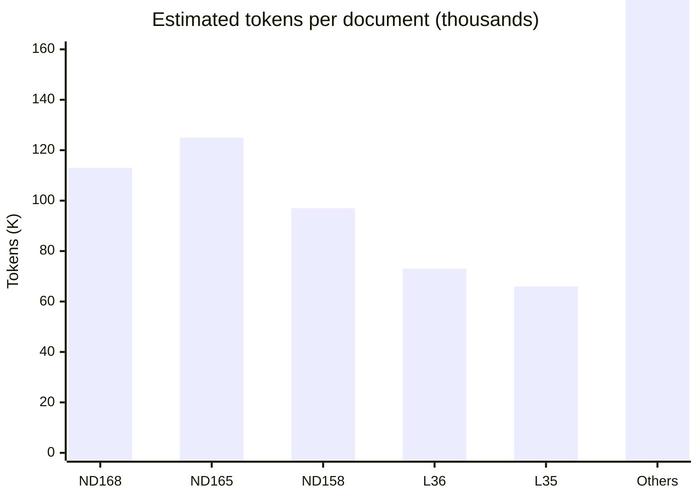
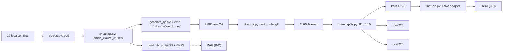
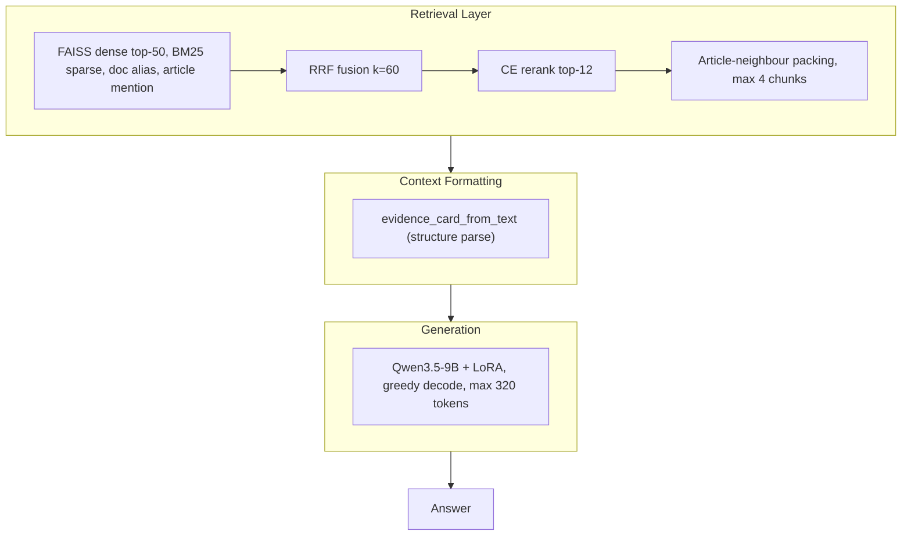
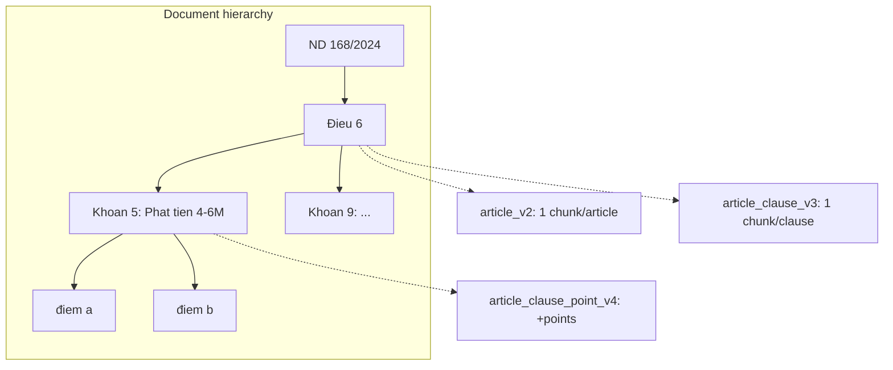
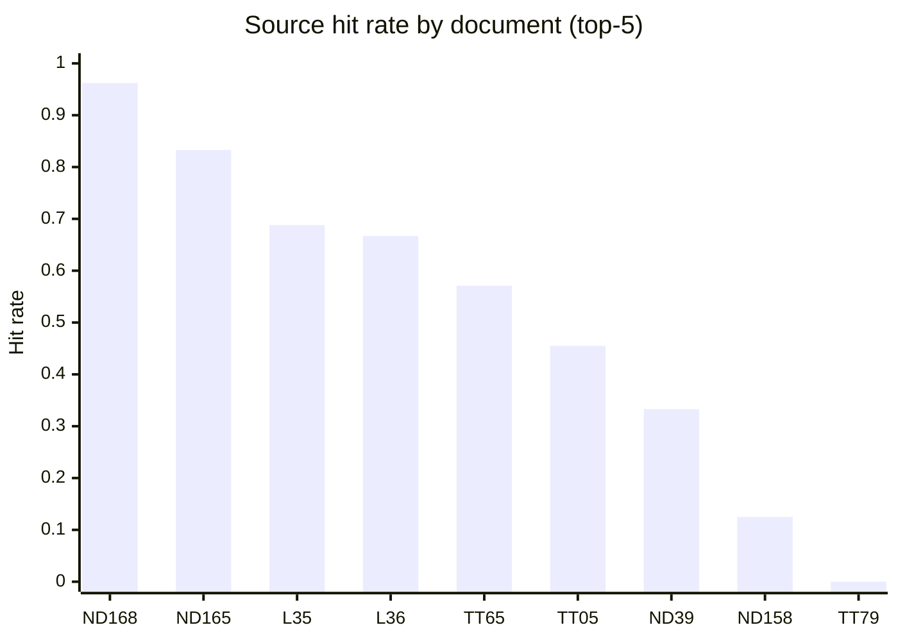
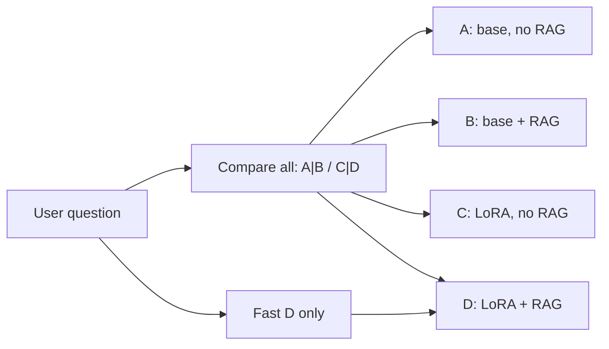

# Vietnamese Traffic-Law QA
## RAG + LoRA Fine-Tuning on Qwen3.5-9B

**NLP Course — Topic 1**
**Author:** Anakonkai01 · May 2026
**Repo:** [`github.com/Anakonkai01/nlp-traffic-laws`](https://github.com/Anakonkai01/nlp-traffic-laws)

<!--
Loi nguoi trinh bay (VN):
Xin chao thay co va cac ban. Hom nay toi trinh bay de tai 1 mon NLP: xay dung he thong Hoi dap Luat Giao thong duong bo Viet Nam su dung kien truc Retrieval-Augmented Generation ket hop LoRA fine-tune tren Qwen3.5-9B. Bai trinh bay se di tu bai toan, du lieu, kien truc, dao sau vao he thong RAG, den ket qua va demo.
-->

---

# Problem Statement

**What:** Build a Vietnamese QA system that answers traffic-law questions using RAG + LoRA.

**Constraints** (from the course):
- LLM 1B-7B params, LoRA/QLoRA, runnable on 16 GB VRAM.
- Full RAG: chunking, embedding, vector store, retriever, prompt.
- 4 configurations: A (base, no RAG), B (base + RAG), C (LoRA, no RAG), D (LoRA + RAG).
- Manual test set >= 50 questions. Demo GUI.

**Domain:** 12 Vietnamese road-traffic law documents (2024-2025), **local_text_only** policy.

---

# Data - Source Corpus

| # | Document | Est. tokens | Articles | Clauses | Points | Role |
|---|---|---|---|---|---|---|
| 1 | NĐ 168/2024 (xử phạt VPHC) | 113K | 55 | 21 | 910 | Central - 73% of eval |
| 2 | NĐ 165/2024 (quy định chi tiết) | 125K | 70 | 17 | 496 | |
| 3 | NĐ 158/2024 (vận tải đường bộ) | 97K | 78 | 15 | 484 | |
| 4 | Luật 36/2024 (trật tự ATGT) | 73K | 89 | 28 | 443 | |
| 5 | Luật 35/2024 (Luật Đường bộ) | 66K | 86 | 14 | 382 | |
| 6-12 | 7 phụ lục (TT, QCVN, NĐ) | 283K | 243 | 91 | 843 | |



---

# Data - QA Generation Pipeline

| Step | Tool | Output |
|---|---|---|
| Generate | `generate_qa.py` (Gemini 2.0 Flash) | 2,885 raw QA pairs |
| Filter | `filter_qa.py` (dedup, length, quality) | 2,202 filtered |
| Split | `make_splits.py` (seed=42, 80/10/10) | train 1,762 / dev 220 / test 220 |

**Each QA row:** `{question, answer, context, article, doc_id, source_policy, corpus}`

**Corpus types:** `local_text` (correct doc), `hard_context` (wrong clause), `negative` (teaches refusal).

---

# Data - Manual Evaluation Set

**`eval_manual_labeled_v5.jsonl`** - 145 hand-written questions

| Label | Count | % |
|---|---|---|
| Gold article numbers | 129 | 89% |
| Gold clause numbers | 126 | 87% |
| Gold point letters | 65 | 45% |
| Gold fine amount (min/max) | 95 | 66% |
| Gold vehicle mentions | 97 | 67% |

**Categories:** 105 general, 15 penalty, 15 procedure, 5 definition, 5 unsupported.

---

# Data Pipeline Overview



---

# Overall Architecture



| Config | A | B | C | **D** |
|---|---|---|---|---|
| Retrieval | no | yes | no | yes |
| LoRA | no | no | yes | yes |

---

# Deep Dive: RAG Pipeline (Default)


*Optional: query rewriting (Gemini) can be inserted before step 2 for demo/live eval.*

---

# RAG Stage 1-2: Query Processing

### Stage 1 - Lexical expansion (always on)

`gplx -> giay phep lai xe`, `xe may -> xe mo to xe gan may`, `o to -> xe hoi xe o to`

- Used for ALL downstream stages: dense, sparse, alias, article, and CE.

### (Optional) Interjection - Query rewriting (cache-first, demo only)

| User asks | Rewritten for retrieval |
|---|---|
| "Lai o to vuot den do bi phat bao nhieu?" | "...khong chap hanh hieu lenh cua den tin hieu giao thong..." |
| "Say ruou khi lai xe may bi phat?" | "...dieu khien xe mo to co nong do con trong mau..." |

- Gemini 2.0 Flash (~$0.005 / 145 queries). Retrieval sees rewrite; generation sees original.

---

# RAG Stage 2: Hybrid Retrieval (4 Lists + RRF)

| Source | Method | Top-K | Weight |
|---|---|---|---|
| **Dense** | FAISS cosine, `bge-m3-traffic-ft` (1024-dim) | 50 | 0.60 |
| **BM25** | `rank_bm25` + `pyvi` VN tokenizer | 50 | 0.40 |
| **Doc alias** | surface match: "nghi dinh 168", "168/2024" | all | 0.03 |
| **Article** | regex `Đieu d+` -> `article_number` metadata | all | 0.07 |

### Reciprocal Rank Fusion

$$score_c = sum_{s} w_s / (k + rank_c(s)), k=60$$

Fused top-40 enter the Cross-Encoder.

---

# RAG Stage 3-5: Rerank, Pack, Format

### Stage 3 - Cross-Encoder rerank
- `BAAI/bge-reranker-v2-m3` (568M, pretrained).
- Query + passage joint input (cross-attention) -> score.
- Top-40 -> top-12. Critical for clause discrimination.

### Stage 4 - Article-neighbour packing
- Add sibling chunks from same (doc_id, article_number). Max 4 chunks.

### Stage 5 - Evidence card (structure parse from text only)

```
EVIDENCE_CARD
Can cu: nd_168_2024_nd_cp Đieu 6 khoan 9
Muc phat: phat tien tu 18.000.000 dong den 20.000.000 dong
```

---

# Chunking - The Single Biggest Lever

| Policy | Chunks | clause_recall | context_recall@5 | D ROUGE-L |
|---|---|---|---|---|
| `article_v2` | 1,597 | 0.00 | 0.525 | 0.327 |
| `article_clause_v3` | 2,853 | **0.81** | **0.975** | **0.515** |
| `article_clause_point_v4` | 5,931 | 0.81 | 0.975 | 0.510 |

**Clause-level chunking = +57% ROUGE-L, clause_recall 0 to 0.81.**



---

# Source Recall Per Document



- ND 168/2024: 0.962 (gold standard).
- Recall bottleneck: ND 168 has near-perfect hit rate.

---

# Fine-Tuning Setup

| Parameter | Value |
|---|---|
| Base model | `Qwen/Qwen3.5-9B` (4-bit NF4, unsloth) |
| LoRA rank / alpha | 32 / 64 |
| Target modules | q, k, v, o, gate, up, down |
| LR / scheduler | 5e-5 / cosine + 5% warmup |
| Epochs / eff. batch | 2 / 16 |
| **Context keep prob** | **0.9** |
| Train / dev | 1,762 / 220 rows |

**Key:** CONTEXT_KEEP_PROB=0.9 -> C and D share the same adapter, no distribution shift.

---

# Results - All Configs

```mermaid
xychart-beta
    title "Metric comparison across 4 configs"
    x-axis ["ROUGE-L", "BLEU-4", "BERTScore", "Judge"]
    y-axis "Score" 0 --> 1
    bar [0.146, 0.019, 0.548, 0.349]
    bar [0.348, 0.079, 0.607, 0.563]
    bar [0.389, 0.146, 0.638, 0.392]
    bar [0.511, 0.364, 0.690, 0.739]
```



*Bars: A (base) | B (base+RAG) | C (LoRA) | D (LoRA+RAG)*

- A < B < C < D on nearly every metric.
- Judge insight: C <= A on factual accuracy - LoRA alone is dangerous.

---

# LLM-Judge vs Surface Metrics

| Config | Judge (/5) | Why |
|---|---|---|
| A | 1.75 | mostly wrong or hallucinated |
| B | 2.81 | right facts, rough style |
| C | 1.96 | looks legal - wrong numbers |
| **D** | **3.70** | right facts + clean style |

Judge confirms: **LoRA without RAG looks authoritative but is factually unsafe.**

---

# Demo - 4 Answers Side by Side



- One question -> 4 answers (A|B / C|D) for direct comparison.
- "Fast D" button: LoRA + RAG only, ~30s cold start.
- Adapter toggle (no VRAM swap) - safe on 16 GB.
- Live rewrite status + RAG context accordion.

---

# Reproducibility

```bash
cd nlp
# 1. Build KB
EMBED_MODEL=models/bge-m3-traffic-ft python src/build_kb.py --force
python src/sparse_bm25.py build

# 2. Evaluate all 4 configs
python src/evaluate.py --configs A B C D \
  --test-file data/eval_manual_labeled_v5.jsonl

# 3. LLM-Judge
export OPENROUTER_API_KEY=...
python scripts/llm_judge.py

# 4. Rewriter + re-eval
python scripts/build_rewrite_cache.py
RAG_QUERY_REWRITE=1 python src/evaluate.py --configs D --samples 145

# 5. Demo
python src/app.py   # -> http://localhost:7860
```

**HF:** `Anakonkai/qwen3.5-9b-lora-traffic-v2`
**GitHub:** `Anakonkai01/nlp-traffic-laws`

---

# Conclusions

1. **Clause-level chunking** = +57% ROUGE-L. Granularity matters most in legal RAG.
2. **RAG > Fine-tune alone for factual QA.** C has high surface scores but fails on facts.
3. **Query rewriting** closes the colloquial-legal gap: Judge +0.05 for ~$0.005.
4. **No rule-base anywhere.** Pure embedding, BM25, CE, chunking, prompt.

<!--
Loi nguoi trinh bay:
4 ket luan. Clause chunking la cai thien lon nhat. RAG quan trong hon fine-tune cho factual QA. Toan bo pipeline la khoa hoc, khong rule-base. Xin cam on. Em san sang tra loi cau hoi.
-->

---

# Thank you
## Questions?

**GitHub** [`Anakonkai01/nlp-traffic-laws`](https://github.com/Anakonkai01/nlp-traffic-laws)
**HF** [`Anakonkai`](https://huggingface.co/Anakonkai)

<!--
Xin cam on. Code, model, dataset deu public. Em san sang demo live.
-->
