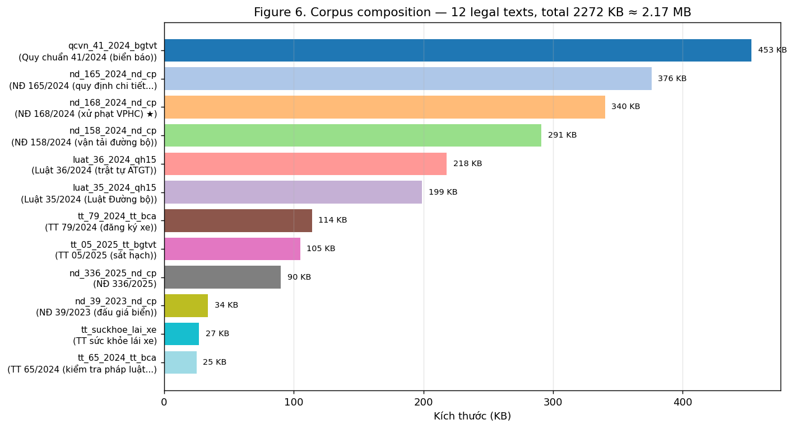
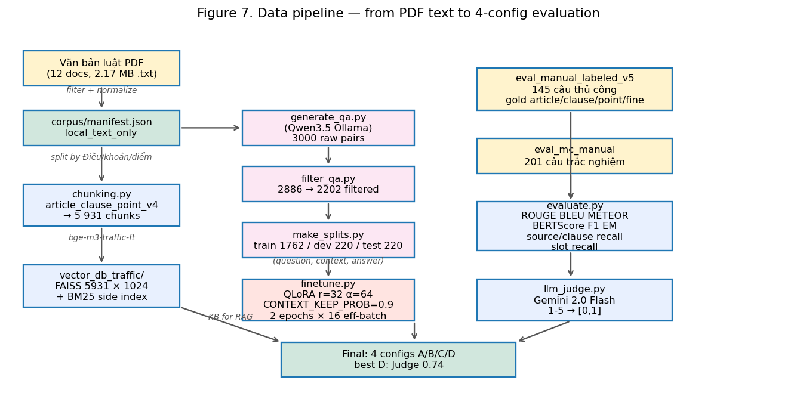
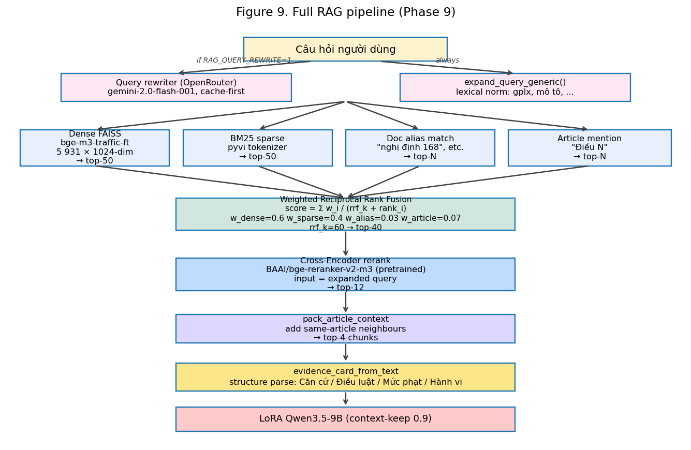
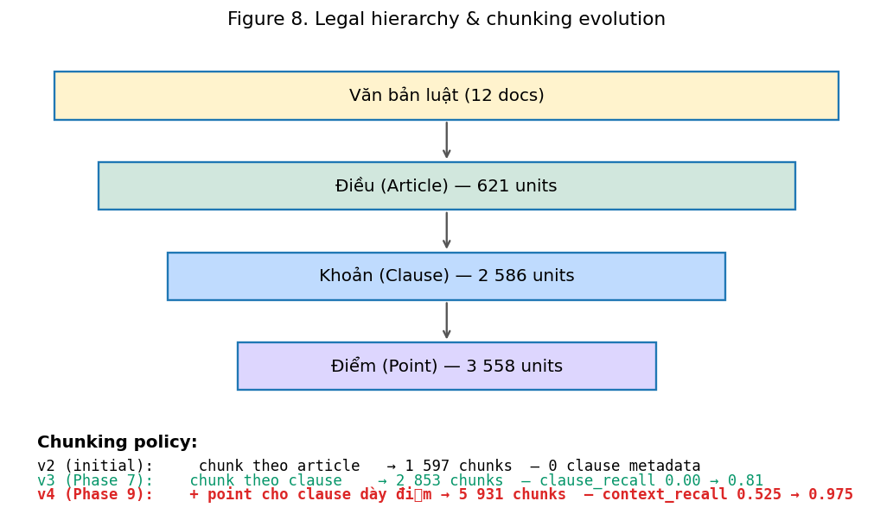
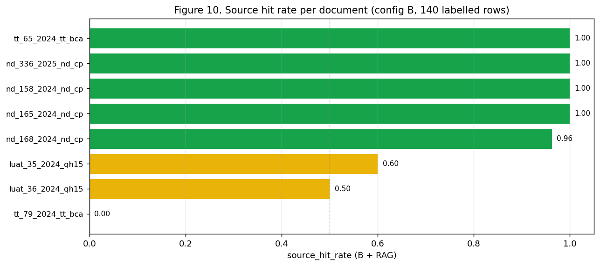

# Vietnamese Traffic-Law QA
## RAG + LoRA Fine-Tuning on Qwen3.5-9B

**NLP Course — Topic 1**
**Author:** Anakonkai01 · May 2026
**Repo:** [`github.com/Anakonkai01/nlp-traffic-laws`](https://github.com/Anakonkai01/nlp-traffic-laws)

<!--
Lời người thuyết trình (VN):
Xin chào thầy cô và các bạn. Hôm nay tôi trình bày đề tài 1 môn NLP: xây dựng hệ thống Hỏi đáp Luật Giao thông đường bộ Việt Nam sử dụng kiến trúc Retrieval-Augmented Generation kết hợp LoRA fine-tune trên Qwen3.5-9B. Bài trình bày sẽ đi từ bài toán, dữ liệu, kiến trúc, đào sâu vào hệ thống RAG, đến kết quả và demo.
-->

---

# Problem Statement

**What:** Build a Vietnamese QA system that answers traffic-law questions using RAG + LoRA.

**Constraints** (from the course):
- LLM 1B–7B params, LoRA/QLoRA, runnable on 16 GB VRAM.
- Full RAG: chunking → embedding → vector store → retriever → prompt.
- 4 configurations: A (base, no RAG), B (base + RAG), C (LoRA, no RAG), D (LoRA + RAG).
- Manual test set ≥ 50 questions. Demo GUI.

**Domain:** 12 Vietnamese road-traffic law documents (2024–2025), **2.17 MB**, `local_text_only` policy.

<!--
Lời người thuyết trình:
Đề bài yêu cầu xây dựng pipeline RAG đầy đủ với 4 cấu hình A/B/C/D, fine-tune LoRA trên model 1-7B tham số chạy được trên Colab Free, và có demo GUI. Tôi chọn domain luật giao thông đường bộ Việt Nam với 12 văn bản chính đang có hiệu lực 2024-2025, tổng 2.17 MB văn bản thuần chữ, chính sách local_text_only — không dùng PDF, không crawl.
-->

---

# Data — Source Corpus

| # | Document | Size | Role |
|---|---|---|---|
| 1 | NĐ 168/2024 (xử phạt VPHC) ★ | 340 KB | central — 73% of eval |
| 2 | NĐ 165/2024 (quy định chi tiết) | 376 KB | |
| 3 | NĐ 158/2024 (vận tải đường bộ) | 291 KB | |
| 4 | Luật 36/2024 (trật tự ATGT) | 218 KB | |
| 5 | Luật 35/2024 (Luật Đường bộ) | 199 KB | |
| 6–12 | 7 phụ lục (TT, QCVN, NĐ) | 886 KB | |



<!--
Lời người thuyết trình:
Corpus gồm 12 văn bản text thuần chữ convert từ PDF công báo. NĐ 168/2024 là văn bản trung tâm — quy định xử phạt giao thông — chiếm 340 KB và xuất hiện trong 73% câu hỏi eval.
-->

---

# Data — QA Generation Pipeline

| step | tool | output |
|---|---|---|
| Generate | `generate_qa.py` (Qwen3.5, Ollama) | 2,885 raw QA pairs |
| Filter | `filter_qa.py` (dedup, length, quality) | 2,202 filtered |
| Split | `make_splits.py` (seed=42, 80/10/10) | train 1,762 / dev 220 / test 220 |

**Each QA row:** `{question, answer, context, article, doc_id, source_policy, corpus}`

**Corpus types:** `local_text` (normal), `hard_context` (wrong-clause distractor), `negative` (no-context dropout).

<!--
Lời người thuyết trình:
QA pairs được sinh tự động bằng Qwen3.5 bản gốc chạy trên Ollama local, sau đó lọc trùng lặp, lọc độ dài, và chia train/dev/test theo seed cố định. Mỗi sample có context là đoạn luật gốc, corpus type có 3 loại: local_text là context đúng, hard_context là context sai clause để dạy model không tin context mù quáng, và negative để dropout context hoàn toàn.
-->

---

# Data — Manual Evaluation Set

**`eval_manual_labeled_v5.jsonl`** — 145 hand-written questions

| label | count | % |
|---|---|---|
| Gold article numbers | 129 | 89% |
| Gold clause numbers | 126 | 87% |
| Gold point letters | 65 | 45% |
| Gold fine amount (min/max) | 95 | 66% |
| Gold vehicle mentions | 97 | 67% |

**Categories:** 105 general, 15 penalty, 15 procedure, 5 definition, 5 unsupported.
**Mean answer length:** 131 chars (median 114).

<!--
Lời người thuyết trình:
Bộ test thủ công có 145 câu được label tay đầy đủ Điều, khoản, điểm, và mức phạt. Chúng tôi không chỉ đo ROUGE/BLEU mà còn đo recall ở cấp điều khoản và mức phạt, để biết chính xác retrieval có đưa đúng clause không.
-->

---

# Data Pipeline Overview



<!--
Lời người thuyết trình:
Tổng quan toàn bộ data pipeline — từ 12 file text luật, qua chunking, xây KB, sinh QA, lọc, split, fine-tune, và đánh giá 4 config. Đây là flow end-to-end reproducible.
-->

---

# Overall Architecture

```
┌──────────────────────────────────────────────┐
│                Retrieval                      │
│  KB (FAISS 5,931 × 1024 + BM25) + CE rerank  │
│  4 rank lists → RRF fusion → top-4 context    │
└──────────────────┬───────────────────────────┘
                   │
                   ▼
┌──────────────────────────────────────────────┐
│           Context Formatting                  │
│  evidence_card_from_text                      │
│  (structure parse: Căn cứ / Mức phạt / Hành vi)│
└──────────────────┬───────────────────────────┘
                   │
                   ▼
┌──────────────────────────────────────────────┐
│              Generation                       │
│  Qwen3.5-9B + LoRA adapter (r=32)            │
│  max 320 tokens, greedy decode                │
└──────────────────────────────────────────────┘
```

| Config | A | B | C | **D ★** |
|---|---|---|---|---|
| Retrieval | ✗ | ✓ | ✗ | **✓** |
| LoRA | ✗ | ✗ | ✓ | **✓** |

<!--
Lời người thuyết trình:
Kiến trúc tổng quát 3 tầng: Retrieval → Format → Generate. Ba tầng này có thể đo riêng biệt. 4 cấu hình là tổ hợp 2 biến: retrieval on/off và LoRA on/off.
-->

---

# Deep Dive: RAG Pipeline (Phase 9)



<!--
Lời người thuyết trình:
Đây là slide quan trọng nhất — pipeline RAG đầy đủ với 7 stage. Mỗi stage đều được ablation riêng trong quá trình làm.
-->

---

# RAG Stage 1–2: Query Processing

### Stage 1 — Lexical expansion (always on)
```python
"gplx" → "giấy phép lái xe"
"xe máy" → "xe mô tô xe gắn máy"
"ô tô" → "xe hơi xe ô tô"
```
- Used for ALL downstream stages: dense, sparse, alias, article, **and CE**.

### Stage 2 — Query rewriting (Phase 9, cache-first)

| User asks | Rewritten for retrieval |
|---|---|
| "Lái ô tô vượt đèn đỏ bị phạt bao nhiêu?" | "...điều khiển xe ô tô **không chấp hành hiệu lệnh của đèn tín hiệu giao thông**..." |
| "Say rượu khi lái xe máy bị phạt?" | "...điều khiển xe mô tô, xe gắn máy **trong khi trong máu hoặc hơi thở có nồng độ cồn**..." |

- Gemini 2.0 Flash (~$0.005 / 145 queries). Retrieval sees rewrite; generation sees original.

<!--
Lời người thuyết trình:
Stage 1 là lexical normalization thuần — không map phrase sang article. Expanded query dùng cho CẢ hybrid retrieval VÀ cross-encoder. Stage 2 là external rewriter dùng Gemini — chi phí cực rẻ. Chỉ retrieval thấy rewrite; generation vẫn dùng original question để LoRA nhận được phrasing đã train.
-->

---

# RAG Stage 3: Hybrid Retrieval (4 Lists + RRF)

| Source | Method | Top-K | Weight |
|---|---|---|---|
| **Dense** | FAISS cosine, `bge-m3-traffic-ft` (1024-dim) | 50 | 0.60 |
| **BM25** | `rank_bm25` + `pyvi` VN tokenizer | 50 | 0.40 |
| **Doc alias** | surface match: "nghị định 168", "168/2024" | all | 0.03 |
| **Article** | regex `Điều \d+` → `article_number` metadata | all | 0.07 |

### Reciprocal Rank Fusion

$$score_c = \sum_{s} \frac{w_s}{k + rank_c^{(s)}}, \quad k=60$$

→ **fused top-40** enter the Cross-Encoder.

<!--
Lời người thuyết trình:
4 rank-list chạy song song, không phụ thuộc lẫn nhau. RRF fusion có trọng số — cho phép chunk top cả 2 trong 4 list vẫn lên top tổng dù kém ở list còn lại.
-->

---

# RAG Stage 4–6: Rerank, Pack, Format

### Stage 4 — Cross-Encoder rerank
- `BAAI/bge-reranker-v2-m3` (568M, pretrained).
- Query + passage **joint input** (cross-attention) → score.
- Top-40 → **top-12**. Critical for clause discrimination.

### Stage 5 — Article-neighbour packing
- Add sibling chunks from the same `(doc_id, article_number)`.
- Total: ≤ 4 chunks per answer.

### Stage 6 — Evidence card (structure parse from text only)
```
EVIDENCE_CARD
Căn cứ: nd_168_2024_nd_cp Điều 6 khoản 9
Mức phạt: phạt tiền từ 18.000.000 đồng đến 20.000.000 đồng
```

<!--
Lời người thuyết trình:
CE rerank nhận query + passage JOINTLY — cross-attention giữa từng từ của query với từng từ của passage. Cực kỳ quan trọng trong legal domain vì "ô tô" vs "mô tô" khác một từ nhưng mức phạt khác hẳn. Article packing bổ sung sibling chunk cùng article. Evidence card parse từ text, không map từ câu hỏi.
-->

---

# Chunking — The Single Biggest Lever



| Policy | Chunks | clause_recall | context_recall@5 | D ROUGE-L |
|---|---|---|---|---|
| `article_v2` | 1,597 | **0.00** | 0.525 | 0.327 |
| `article_clause_v3` | 2,853 | **0.81** | **0.975** | **0.515** |
| `article_clause_point_v4` | 5,931 | 0.81 | 0.975 | 0.510 |

**Clause-level chunking = +57% ROUGE-L, clause_recall 0 → 0.81.**

<!--
Lời người thuyết trình:
Phát hiện quan trọng nhất. Article_v2: 1 article = 1 chunk → embedding bị dominate bởi title → clause recall = 0.00. Clause_v3: mỗi clause có vector riêng → recall 0.81, context recall 0.975. Đây là bài học: trong legal RAG, granularity của chunking quyết định mọi thứ.
-->

---

# Source Recall Per Document



- NĐ 168/2024: **0.962** (gold standard).
- Retrieval bottleneck: NĐ 168 has near-perfect hit rate.

<!--
Lời người thuyết trình:
NĐ 168 đạt gần 1.0 source hit. Các thông tư nhỏ hơn có recall thấp hơn vì eval set ít câu tham chiếu. Đây không phải retrieval lỗi mà do phân phối eval.
-->

---

# Fine-Tuning Setup

| parameter | value |
|---|---|
| Base model | `Qwen/Qwen3.5-9B` (4-bit NF4, unsloth) |
| LoRA rank / alpha | 32 / 64 |
| Target modules | q, k, v, o, gate, up, down |
| LR / scheduler | 5e-5 / cosine + 5% warmup |
| Epochs / eff. batch | 2 / 16 |
| **Context keep prob** | **0.9** |
| Train / dev | 1,762 / 220 rows |

**Key:** CONTEXT_KEEP_PROB=0.9 → C and D share the same adapter → no distribution shift.

<!--
Lời người thuyết trình:
CONTEXT_KEEP_PROB=0.9 là then chốt — model thấy context 90% thời gian khi train, nên cả C và D dùng chung một adapter. Đây là lý do RAG-SFT thất bại ở Phase 8.
-->

---

# Results — All Configs


| Config | R-L | BLEU | METEOR | BERTSc | **Judge** |
|---|---|---|---|---|---|
| A | 0.146 | 0.019 | 0.257 | 0.548 | 0.349 |
| B | 0.348 | 0.079 | 0.420 | 0.607 | 0.563 |
| C | 0.389 | 0.146 | 0.410 | 0.638 | 0.392 |
| **D ★** | **0.511** | **0.364** | **0.471** | **0.690** | **0.739** |

- A < B < C < D on nearly every metric.
- **Judge insight:** C ≤ A on factual accuracy — LoRA alone is dangerous.

<!--
Lời người thuyết trình:
D thắng toàn bộ metric. Insight quan trọng: C < B về Judge vì C tự bịa số tiền dù format đẹp. RAG mới là thành phần quan trọng nhất cho factual QA.
-->

---

# LLM-Judge vs Surface Metrics

| Config | Judge (/5) | Why |
|---|---|---|
| A | 1.75 | mostly wrong or hallucinated |
| B | 2.81 | right facts, rough style |
| C | 1.96 | looks legal — wrong numbers |
| **D** | **3.70** | right facts + clean style |

Judge confirms: **LoRA without RAG looks authoritative but is factually unsafe.**

<!--
Lời người thuyết trình:
Điểm judge xác nhận: C 1.96/5 — chỉ hơn A chút, dù surface metrics cao hơn B. RAG mới là ingredient quyết định factual correctness.
-->

---

# Phase Evolution


| phase | change | D ROUGE-L |
|---|---|---|
| 0 | rule-base (starting) | 0.327 |
| 1–6 | remove hacks + CE + ft embedder | 0.458 |
| **7** | **clause-level chunking** | **0.515** (+57%) |
| 8 | RAG-SFT LoRA (E) | fail (0.40) |
| 9 | point chunks + query rewriter | 0.511 · **Judge 0.74** |

<!--
Lời người thuyết trình:
Tiến trình qua 6 mốc. Phase 7 là breakthrough lớn nhất. Phase 8 là negative result có giá trị khoa học. Phase 9 đẩy Judge lên 0.74.
-->

---

# Demo — 4 Answers Side by Side


- **One question → 4 answers (A|B / C|D)** for direct comparison.
- "Fast D" button: LoRA + RAG only, ~30s cold start.
- Adapter toggle (no VRAM swap) — safe on 16 GB.
- Live rewrite status + RAG context accordion.

<!--
Lời người thuyết trình:
Demo so sánh trực quan 4 cấu hình. Adapter toggle thay vì reload model để tránh OOM. Có nút Fast D. Mỗi câu trả lời có RAG citation. Tôi có thể bật demo live sau trình bày.
-->

---

# Reproducibility

```bash
cd nlp
# 1. Build KB
EMBED_MODEL=models/bge-m3-traffic-ft python src/build_kb.py --force
python src/sparse_bm25.py build

# 2. Evaluate all 4 configs
python src/evaluate.py --configs A B C D \
  --test-file data/eval_manual_labeled_v5.jsonl

# 3. LLM-Judge
export OPENROUTER_API_KEY=...
python scripts/llm_judge.py

# 4. Rewriter + re-eval
python scripts/build_rewrite_cache.py
RAG_QUERY_REWRITE=1 python src/evaluate.py --configs D --samples 145

# 5. Demo
python src/app.py   # → http://localhost:7860
```

**HF:** `Anakonkai/qwen3.5-9b-lora-traffic-v2` · `bge-m3-traffic-ft` · `nlp-traffic-qa`
**GitHub:** `Anakonkai01/nlp-traffic-laws`

<!--
Lời người thuyết trình:
5 lệnh reproduce toàn bộ pipeline. Model và dataset public trên HF + GitHub.
-->

---

# Conclusions

1. **Clause-level chunking** = +57% ROUGE-L. Granularity matters most in legal RAG.
2. **RAG > Fine-tune alone for factual QA.** C has high surface scores but fails on facts.
3. **Query rewriting** closes the colloquial→legal gap: Judge +0.05 for ~$0.005.
4. **No rule-base anywhere.** No phrase→article lookup, no regex severity, no LLM bypass. Pure embedding, BM25, CE, chunking, prompt.

<!--
Lời người thuyết trình:
4 kết luận. Clause chunking là cải thiện lớn nhất. RAG quan trọng hơn fine-tune cho factual QA. Rewriter rẻ và hiệu quả. Toàn bộ pipeline là khoa học, không rule-base. Xin cảm ơn. Em sẵn sàng trả lời câu hỏi.
-->

---

# Thank you
## Questions?

**GitHub** [`Anakonkai01/nlp-traffic-laws`](https://github.com/Anakonkai01/nlp-traffic-laws)
**HF** [`Anakonkai`](https://huggingface.co/Anakonkai)

<!--
Lời người thuyết trình:
Xin cảm ơn. Code, model, dataset đều public. Em sẵn sàng demo live.
-->
