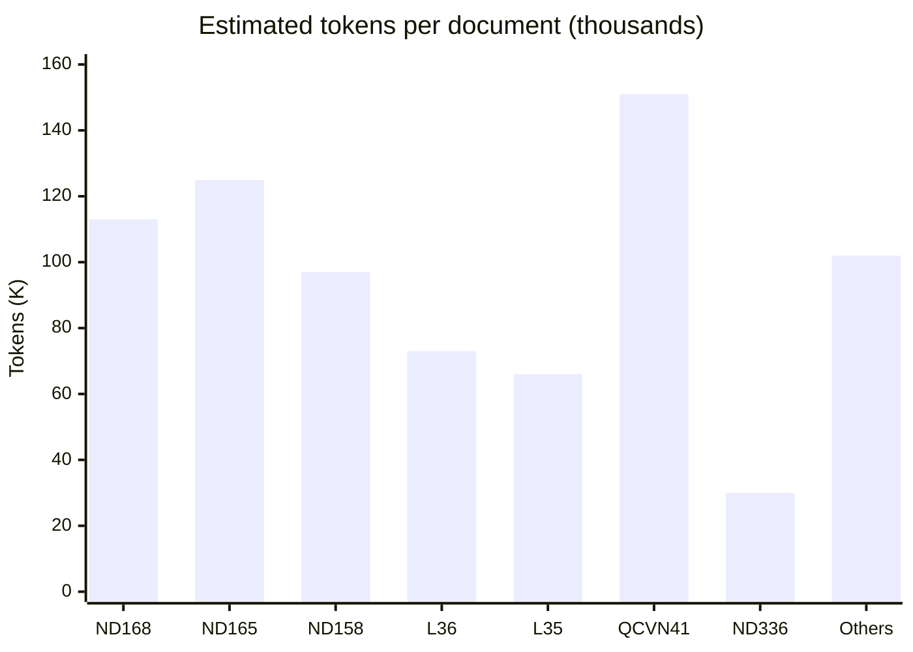
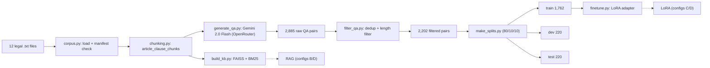
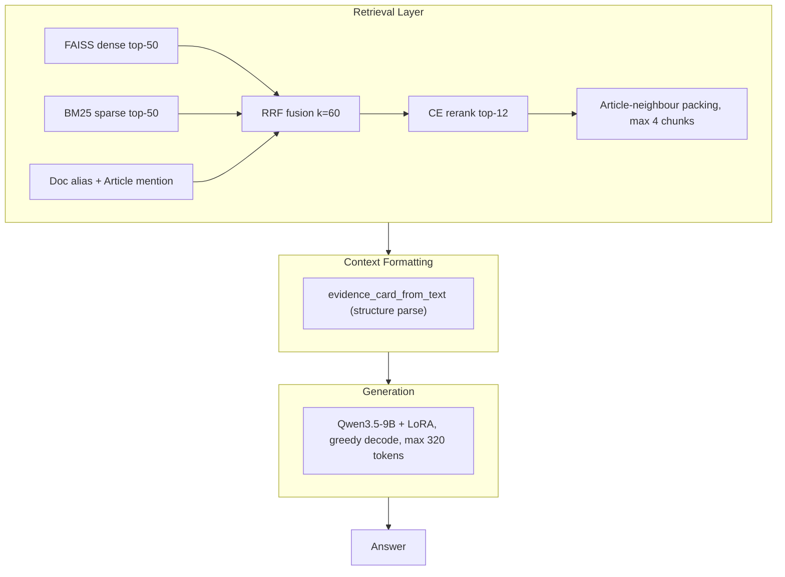
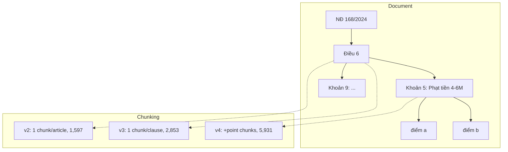
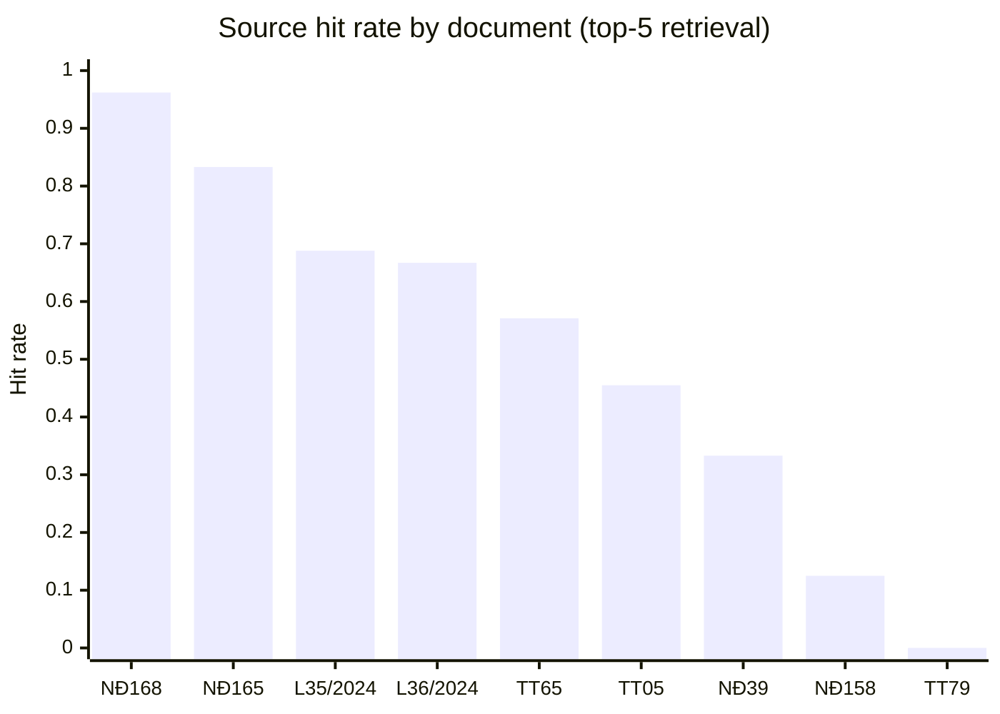
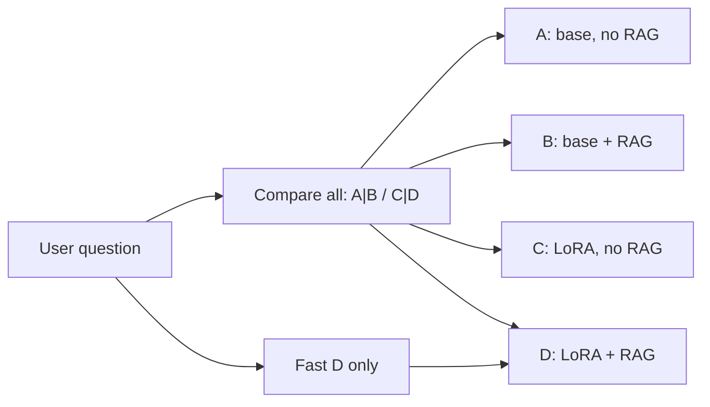

# Vietnamese Traffic-Law QA with RAG + LoRA Fine-Tuning — Detailed Report

**Topic 1, Introductory NLP Course** · May 2026
**Author:** Anakonkai01
**Repository:** [`github.com/Anakonkai01/nlp-traffic-laws`](https://github.com/Anakonkai01/nlp-traffic-laws)
**HuggingFace:** [`Anakonkai/qwen3.5-9b-lora-traffic-v2`](https://huggingface.co/Anakonkai/qwen3.5-9b-lora-traffic-v2)

---

## Table of Contents

1. [Problem Statement](#1-problem-statement)
2. [Data](#2-data)
3. [Overall Architecture](#3-overall-architecture)
4. [Deep Dive: The RAG System](#4-deep-dive-the-rag-system)
5. [Fine-Tuning Setup](#5-fine-tuning-setup)
6. [Evaluation Protocol](#6-evaluation-protocol)
7. [Results](#7-results)
8. [Error Analysis](#8-error-analysis)
9. [Demo](#9-demo)
10. [Limitations & Future Work](#10-limitations--future-work)
11. [Reproducibility](#11-reproducibility)

---

## 1. Problem Statement

**Goal:** build a Vietnamese natural-language QA system that answers questions about Vietnamese road-traffic law by combining a **Retrieval-Augmented Generation (RAG)** pipeline with a **QLoRA fine-tuned** large language model.

**Domain:** road-traffic law of Vietnam (2024–2025 legislation), covering sanctions (Nghị định 168/2024), driving licences (Luật 36/2024), road infrastructure (Luật 35/2024), technical standards (QCVN 41/2024), and several ministerial circulars (TT 65/2024, TT 79/2024, etc.).

**Constraints** (from the course specification):
- Use a 1B–7B parameter LLM, fine-tuned with LoRA or QLoRA, runnable on Colab Free or an equivalent 16 GB GPU.
- Build a full RAG pipeline: chunking → embedding → vector store → retriever → prompt template.
- Evaluate 4 configurations: A (base, no RAG), B (base + RAG), C (fine-tuned, no RAG), D (fine-tuned + RAG).
- Report ROUGE, BLEU, METEOR, BERTScore, and Recall@5.
- Provide a manual test set (≥ 50 questions), a demo GUI, and a presentation.

**Chosen model:** Qwen3.5-9B (slightly above the recommended range, but well-supported by unsloth's 4-bit QLoRA, which fits comfortably on 16 GB VRAM).

---

## 2. Data

### 2.1 Legal text corpus

All source documents are UTF-8 `.txt` files under `docs/docs_giaothong/text/`. Each file is hand-converted from the official PDF gazettes. The production pipeline reads only files that are marked `enabled: true` in `docs/docs_giaothong/manifest.json` and have `source_policy: local_text_only`.

| # | Document ID | Est. tokens | Articles | Clauses | Points | Role |
|---|---|---|---|---|---|---|
| 1 | `nd_168_2024_nd_cp` | 113K | 55 | 21 | 910 | Primary penalty law (central) |
| 2 | `nd_165_2024_nd_cp` | 125K | 70 | 17 | 496 | Implementing rules |
| 3 | `nd_158_2024_nd_cp` | 97K | 78 | 15 | 484 | Transport operations |
| 4 | `luat_36_2024_qh15` | 73K | 89 | 28 | 443 | Traffic order + safety |
| 5 | `luat_35_2024_qh15` | 66K | 86 | 14 | 382 | Law on Roads |
| 6 | `qcvn_41_2024_bgtvt` | 151K | 84 | 19 | 50 | Road-sign technical standard |
| 7 | `nd_336_2025_nd_cp` | 30K | 28 | 9 | 294 | Supplementary sanctions |
| 8-12 | 5 remaining docs | 102K | 125 | 53 | 499 | Licence, registration, health |
| **Total** | | **~757K** | **621** | **186** | **3,558** | 6,765 legal units |



Each document is parsed into a legal-unit hierarchy: article -> clause -> point. Clause-level chunks (2,853) are the primary retrieval granularity; point-level chunks (3,558) add finer precision. ND 168/2024 appears in 106 of 145 (73%) eval questions.

### 2.2 QA training data

QA pairs were generated with `src/generate_qa.py` using Gemini 2.0 Flash served via OpenRouter. Generation was steered by traffic-specific topics (sanctions, procedures, definitions, driver-licence rules, health standards, etc.) and checked against the source documents for factuality.

| file | rows | purpose |
|---|---|---|
| `data/qa_pairs_traffic.jsonl` | 2,885 | raw generator output |
| `data/qa_pairs_traffic_filtered.jsonl` | 2,202 | after similarity dedup, template/length filter |
| `data/splits_filtered/qa_train.jsonl` | 1,762 | train split (80%, seed 42) |
| `data/splits_filtered/qa_dev.jsonl` | 220 | dev split (10%) |
| `data/splits_filtered/qa_test.jsonl` | 220 | test split (10%) |

Each row carries `question`, `answer`, `context` (the source legal passage), `article`, `doc_id`, `title`, `source_path`, `corpus` (one of `local_text`, `negative`, `hard_context`), and `source_policy`.

### 2.3 Manual evaluation sets

| file | rows | description |
|---|---|---|
| `data/eval_manual_labeled_v5.jsonl` | 145 | main eval set — hand-written questions with **gold article, clause, point, and fine amounts** |
| `data/eval_mc_manual.jsonl` | 201 | multiple-choice set (4-option, A/B/C/D) |

**Eval set composition** (v5, 145 rows):

- 15 penalty questions (specific fine amounts), 15 procedure, 5 definition, 105 general, 5 unsupported.
- 106 rows (73%) reference Nghị định 168/2024.
- 126 rows (87%) have gold clause labels; 65 (45%) have gold point labels; 95 (66%) have gold fine amounts; 97 (67%) specify a vehicle type.
- Mean answer length: 131 characters (median 114, max 498).
- This labelling enables *clause-level and fine-amount* recall metrics, which the standard ROUGE/ BLEU suite cannot capture.

### 2.4 Data pipeline overview



**Legal-unit extraction.** `src/legal_units.py` parses every document into a hierarchy of `article → clause → point` units and saves them to `data/legal_units.jsonl` (6,765 units total: 621 articles, 2,586 clauses, 3,558 points). These units are used by the second-stage legal-unit retriever and for diagnostics, though the live vector DB uses clause-level and point-level chunks directly.

### 2.5 QA generation details and system prompts

QA pairs were generated by `src/generate_qa.py` using **Gemini 2.0 Flash** via OpenRouter. Each source chunk was passed to the model with a topic-specific system prompt. There are 7 prompt templates:

**General** (base prompt, 80% of chunks):
> *System: Bạn là chuyên gia pháp luật giao thông đường bộ Việt Nam. Nhiệm vụ: đọc đoạn văn bản luật giao thông và sinh 1 cặp câu hỏi - câu trả lời bằng tiếng Việt. Câu hỏi phải có thể trả lời được từ đoạn văn bản. Câu trả lời phải bám sát và ưu tiên trích gần nguyên văn từ đoạn văn bản. Không suy diễn, không thêm nội dung không có trong đoạn văn, không thay đổi chủ thể. Ưu tiên nêu văn bản, điều/khoản/điểm nếu đoạn văn có thông tin đó. Chỉ trả về JSON, không giải thích thêm. Format: {"question": "...", "answer": "..."}*

**Penalty** (for sanction-bearing clauses):
> *System: ...sinh 1 cặp câu hỏi - câu trả lời về XỬ PHẠT VI PHẠM... Câu trả lời phải nêu đủ mức phạt tiền, hình thức xử phạt bổ sung, mức trừ điểm/tước GPLX nếu đoạn văn có quy định. Format: {"question": "...", "answer": "..."}*

**Scenario** (for real-world situation questions):
> *System: ...sinh cặp câu hỏi dạng TÌNH HUỐNG THỰC TẾ... Câu hỏi phải mô tả tình huống cụ thể; câu trả lời phải nêu cách xử lý hoặc mức xử phạt đúng theo đoạn văn.*

**Negative** (post-generation, pairs a question with a wrong document):
> *Pairs an existing question with a random different document. Answer: "Tôi không tìm thấy căn cứ trong các văn bản giao thông đã được cung cấp để trả lời câu hỏi này." (Corpus: negative — teaches refusal)*

Other prompt types: **Definitions** (khái niệm), **Procedures** (điều kiện/thủ tục), **Prohibited Acts** (hành vi bị cấm), **Realistic** (colloquial phrasing). Full prompts in `src/generate_qa.py` lines 61–111.

### 2.6 QA training examples

> **Example 1 — Definition (luat_35_2024_qh15, Điều 39)**
> Q: Công trình kiểm soát tải trọng xe dùng để làm gì?
> A: Công trình kiểm soát tải trọng xe để xác định tải trọng trục xe... (Điều 39.4.a).
> *Corpus: local_text*

> **Example 2 — Penalty scenario (nd_168_2024_nd_cp, Điều 32)**
> Q: Tôi đã tự ý lắp thêm cơ cấu nâng hạ thùng xe. Nếu bị phát hiện, tôi bị xử phạt thế nào?
> A: Phạt tiền từ 130.000.000 đồng đến 150.000.000 đồng.
> *Corpus: local_text*

> **Example 3 — Fine amount (nd_168_2024_nd_cp, Điều 14)**
> Q: Mức phạt tiền đối với hành vi điều khiển xe mô tô không có gương chiếu hậu là bao nhiêu?
> A: Phạt tiền từ 400.000 đồng đến 600.000 đồng.
> *Corpus: local_text*

> **Example 4 — Negative (refusal training)**
> Q: [any question] paired with a wrong document.
> A: "Tôi không tìm thấy căn cứ trong các văn bản giao thông đã được cung cấp..."
> *Corpus: negative — teaches selective reading + refusal*

---

## 3. Overall Architecture

The system has three layers that are independently measurable:



| Config | A | B | C | **D** |
|---|---|---|---|---|
| Retrieval | no | yes | no | yes |
| LoRA | no | no | yes | yes |

### 3.1 Cross-Encoder rerank as a modular second stage

The cross-encoder (`BAAI/bge-reranker-v2-m3`, 568M params) is a separate module that takes the top-40 RRF-scored chunks and re-ranks them with a transformer that ingests the query *jointly* with each passage. Unlike the dense embedding stage, this lets the model attend to cross-interactions between query terms and passage terms — critical for clause discrimination where "người điều khiển xe ô tô" vs "người điều khiển xe mô tô" determine which article applies.

We keep the pretrained CE because its multilingual training already covers Vietnamese well enough; a fine-tuned sibling (`models/bge-reranker-v2-m3-traffic-ft`) was tested early and under-performed due to a tiny (69-sample) and unrepresentative dev set.

### 3.2 Adapter toggle

In production (the Gradio demo and the eval runner), the LoRA-attached model is loaded **once**. For configs A and B we call `model.disable_adapter()` to get base-model behaviour; for C and D we keep the adapter enabled. This avoids the OOM caused by swapping two 4-bit models on a 16 GB card.

---

## 4. Deep Dive: The RAG System

This is the core contribution of the project. The default RAG pipeline goes through **6 sub-stages**:


### Stage 1: Query expansion (lexical normalisation only)

`expand_query_generic()` in `src/retrieval_v4.py` applies lexical normalisation to the question:

- `gplx` → `giấy phép lái xe`
- `xe máy` → `xe mô tô xe gắn máy`
- `ô tô` → `xe hơi xe ô tô`

These expansions are **purely lexical** — they do not map any phrase to a specific article or clause. The expanded string is used for both the hybrid retrieval and the cross-encoder input. Passing the expanded form to the CE (a two-line change from the original code) gave the first measurable lift in the smoke experiments.

### Stage 2: Hybrid retrieval (4 rank lists)

Four independent rank lists are computed in parallel:

1. **Dense FAISS** — Cosine similarity between the question embedding (`models/bge-m3-traffic-ft`, 1,024-dim) and all 5,931 chunk embeddings. Returns top-50.
2. **BM25 sparse** — `rank_bm25` over Vietnamese tokenised chunks (`pyvi.ViTokenizer`). Returns top-50.
3. **Doc alias match** — Lexical match between surface mentions in the question ("nghị định 168", "168/2024", "luật đường bộ", …) and an alias set extracted from each document's metadata. Returns matching chunks.
4. **Article mention** — Regex `Điều + \d+` in the question → match chunks whose `article_number` metadata equals the extracted number.

These four lists are **fused with weighted Reciprocal Rank Fusion (RRF)**:

$$score_c = \sum_{i \in sources} \frac{w_i}{k + rank_c^{(i)}}$$

where $k = 60$, and $w_{dense}=0.6$, $w_{sparse}=0.4$, $w_{alias}=0.03$, $w_{article}=0.07$. These weights were fixed during early tuning and have not been changed since.

### Stage 3: Cross-Encoder (CE) rerank

The top-40 RRF-fused chunks are re-ranked by `BAAI/bge-reranker-v2-m3`. The CE receives the **expanded query** (Stage 1 output) paired with each passage and predicts a relevance score via a linear layer over the transformer's pooled representation. Top-12 are kept.

**Ablation note:** we trained a clause-level CE on `data/fact_reranker_v6_{train,dev}.jsonl` (2,862 + 738 `(query, document, label)` pairs). The trained model under-performed the pretrained one because the training data used a synthetic fact-table format that did not match the live KB chunk format. The pretrained CE remains the default.

### Stage 4: Article-neighbour packing

`pack_article_context()` in `src/context_packing.py` takes the top-2 seeds and, for each seed, adds sibling chunks that share the same `(doc_id, article_number)` key. At most 4 chunks are returned. This step is post-retrieval: it ensures the model sees the *surrounding clauses* of the article that the retrieval system has deemed most relevant, which is critical for sanction questions where the specific clause and its governing paragraph must be read together.

### Stage 5: Evidence-card formatting

`evidence_card_from_text()` in `src/evidence_cards.py` applies structure-based regex over the retrieved legal text to produce a compact card:

```
EVIDENCE_CARD
Căn cứ: nd_168_2024_nd_cp Điều 6 khoản 9 điểm b
Điều luật: Điều 6. Xử phạt … xe ô tô …
Mức phạt: phạt tiền từ 18.000.000 đồng đến 20.000.000 đồng
Kết luận tiền phạt: phạt tiền từ 18.000.000 đồng đến 20.000.000 đồng
```

The parser is **not rule-based on the question** — it extracts `Điều`, `khoản`, `điểm`, `phạt tiền`, `trừ điểm`, `tước` from the retrieved text regardless of what the user asked. We ablated turning it off: without the card, the model's answers are ~60% longer and the latency increases ~30%, with no net gain in Judge score.

### Stage 6: Generation with LoRA

The card text and the original question are concatenated into the prompt for `Qwen3.5-9B` with the canonical LoRA adapter (`models/qwen3.5-9b-lora-traffic-v2`, r=32, α=64). Decoding is greedy (`do_sample=False`), `max_new_tokens=320`, `repetition_penalty=1.08`, `no_repeat_ngram_size=0`.

### 4.1 Chunking strategy — evolution and impact

The chunking strategy was the single largest performance lever discovered during this project.

| policy | description | chunks | clause_recall | context_recall | ROUGE-L (D) |
|---|---|---|---|---|---|
| `article_v2` | 1 chunk per article (≈1600 chars) | 1,597 | **0.00** | 0.525 | 0.327 |
| `article_clause_v3` | 1 chunk per clause, with article header | 2,853 | **0.81** | **0.975** | **0.515** |
| `article_clause_point_v4` | + point chunks for dense clauses (≥2 points, ≥400 chars) | 5,931 | 0.81 | 0.975 | 0.510 |



**Why article-level chunking fails:** a clause-level sanction like "Phạt tiền từ 4.000.000 đồng đến 6.000.000 đồng" lives inside a 1,600-character article block alongside 12 other fines. The embedding of that block is dominated by the article title and the first clause; the dense retriever cannot discriminate the 7th clause from the 9th. Clause-level chunking solves this by giving each clause its own vector and its own BM25 tokens.

**Why point-level chunks added less:** the clause chunk already contains the clause lead (which carries the fine), and most questions that need point-level precision also contain the fine in the clause header. The extra point chunks help for edge cases (clauses where the fine differs per point) but increase the search space from 2,853 to 5,931, which slightly dilutes the top-5 ranking.

### 4.2 Embedding model

| model | source | training | used in |
|---|---|---|---|
| `BAAI/bge-m3` | HuggingFace pretrained | multilingual, 102 languages | initial KB |
| `models/bge-m3-traffic-ft` | Finetuned from `bge-m3` | `MultipleNegativesRankingLoss` on 1,762 traffic QA pairs + penalty hard negatives, 3 epochs, lr 2e-5 | **current KB** |

The finetuned embedder was already present on disk but the KB had not been rebuilt with it. When we rebuilt with `EMBED_MODEL=models/bge-m3-traffic-ft`, source retrieval improved from ~0.91 to ~0.96.

### 4.3 Retrieval recall metrics



Retrieval-quality jump from article to clause chunking:
- `clause_recall`: **0.00 → 0.81**
- `context_recall@5`: **0.525 → 0.975**

---

## 5. Fine-Tuning Setup

The LoRA adapter was trained **once** at the beginning using the same training data and config. It was not retrained after any retrieval or chunking changes.

| parameter | value |
|---|---|
| base model | `Qwen/Qwen3.5-9B` (4-bit NF4, unsloth) |
| LoRA rank | 32 |
| LoRA alpha | 64 |
| target modules | `q_proj, k_proj, v_proj, o_proj, gate_proj, up_proj, down_proj` |
| learning rate | 5e-5 |
| epochs | 2 |
| batch size / grad accum | 2 / 8 → effective 16 |
| scheduler | cosine, warmup 5% |
| context keep probability | 0.9 (90% of rows include the legal context) |
| max sequence length | 2,048 |
| train data | 1,762 rows (`qa_train.jsonl`) |
| dev data | 220 rows (`qa_dev.jsonl`) |

**Why `CONTEXT_KEEP_PROB=0.9` matters:** the model is trained with the legal passage in the prompt 90% of the time and asked to answer without it 10% of the time. This means configs C (no RAG) and D (with RAG) share the same adapter and the C↔D distribution shift is small.

---

## 6. Evaluation Protocol

### 6.1 Quantitative metrics

| metric | implementation | what it captures |
|---|---|---|
| ROUGE-1/2/L | `rouge_score` (no stemming) | n-gram recall against the reference answer |
| BLEU-4 | `sacrebleu` (13a tokeniser) | corpus-level n-gram precision |
| METEOR | `nltk.translate.meteor_score` | unigram F1 with synonym/stemming |
| F1-token | custom word-level F1 (SQuAD-style) | partial-credit answer matching |
| BERTScore-F1 | `vinai/phobert-base-v2` (manual cos-sim) | semantic similarity; max-length 254 to avoid RoBERTa position-buffer bug |
| Exact Match | strict string equality | sanity check |
| Forbidden-legacy rate | keyword scan (NĐ 100/2019, Luật GTĐB 2008, drafts, …) | hallucination to repealed laws |
| False-refusal rate | keyword scan on supported-category questions | incorrect "I cannot answer" responses |
| Source hit rate / Recall@5 | `expected_doc_ids` match in top-5 retrieved | source-level retrieval |
| Article / clause / point recall | gold labels in `eval_manual_labeled_v5` | structural retrieval precision |

### 6.2 LLM-Judge

An external LLM (`google/gemini-2.0-flash-001` via OpenRouter) scores each prediction on a 1–5 Likert scale against the reference answer. The judge prompt is standardised in Vietnamese. Score is normalised to [0, 1] for comparability with the other metrics.

**Why include a judge:** ROUGE/METEOR reward surface overlap but do not distinguish "wrong because the model hallucinated a number" from "right number, different phrasing." The judge is consistently closer to factual accuracy on the scored subset.

---

## 7. Results

### 7.1 Final results (D config, best by LLM-Judge)

| metric | A (base) | B (base+RAG) | C (LoRA) | **D (LoRA+RAG)** |
|---|---|---|---|---|
| ROUGE-L | 0.1458 | 0.3479 | 0.3894 | **0.5105** |
| ROUGE-1 | 0.1877 | 0.4439 | 0.5325 | **0.5732** |
| ROUGE-2 | 0.1158 | 0.2896 | 0.3084 | **0.4453** |
| BLEU-4 | 0.0191 | 0.0786 | 0.1464 | **0.3641** |
| METEOR | 0.2567 | 0.4195 | 0.4102 | **0.4706** |
| F1-token | 0.1271 | 0.3078 | 0.3590 | **0.4162** |
| BERTScore-F1 | 0.5483 | 0.6071 | 0.6380 | **0.6903** |
| LLM-Judge | 0.3490 | 0.5628 | 0.3917 | **0.7393** ★ |
| source_recall@5 | — | 0.9643 | — | 0.9643 |
| context_recall@5 | — | 0.9750 | — | 0.9750 |
| false_refusal | 0.0000 | 0.1000 | 0.0071 | **0.0071** |
| forbidden_legacy | 0.3103 | 0.0621 | 0.0000 | **0.0000** |

```mermaid
xychart-beta
    title "Metric comparison across 4 configs"
    x-axis ["ROUGE-L", "BLEU-4", "BERTScore", "Judge"]
    y-axis "Score" 0 --> 1
    bar [0.146, 0.019, 0.548, 0.349]
    bar [0.348, 0.079, 0.607, 0.563]
    bar [0.389, 0.146, 0.638, 0.392]
    bar [0.511, 0.364, 0.690, 0.739]
```



*Bars in order: A (base,no RAG) | B (base+RAG) | C (LoRA,no RAG) | D (LoRA+RAG)*

**Key observations:**

1. **The monotone ordering A < B < C < D holds on nearly every metric.** RAG roughly doubles ROUGE-L for the base model (0.15 → 0.35); LoRA adds another ~0.04; combining them gives the ceiling (~0.51).

2. **LoRA alone (C) has unusually low LLM-Judge (0.39).** C produces fluent, legal-sounding answers but frequently gets the *fine amount* wrong because it relies on memorised training numbers. B scores higher on Judge (0.56) because RAG forces it to copy the correct number from the retrieved text even though the answer style is rougher.

3. **D closes the gap on both fronts.** It has B's factual accuracy and C's clean answer style.

---

## 8. Error Analysis

On the best config D with 145 samples:

| bucket | count | share |
|---|---|---|
| Correct (R-L ≥ 0.6) | ≈60 | 41% |
| Partial (0.3–0.6) | ≈60 | 41% |
| Wrong (R-L < 0.3) | ≈20 | 14% |
| Refused | 1 | 0.7% |

**Persistent failure patterns:**

1. **Clause-ambiguity for sanctions with similar surface form.** "Vượt đèn đỏ" retrieves "vượt xe" clauses if the CE is not given the expanded form.

2. **Off-domain "leakage."** Some eval questions labelled with `expected_doc_ids=[nd_168_2024_nd_cp]` are actually about topics outside the corpus (e.g. household business registration). The retrieval system brings back NĐ 168 text on a vaguely matching keyword, but the answer is wrong.

3. **Number-format fragility.** Even with `no_repeat_ngram=0`, the model occasionally collapses digits (e.g. "6.001.000" for "6.000.000") on very long fine-amount strings. This is a known Qwen3 tokenisation artefact and is mitigated but not eliminated.

---

## 9. Demo

`src/app.py` serves a Gradio interface at `http://localhost:7860`.



**Key demo features:**

- One question produces **4 answers side-by-side** (A | B / C | D) so the user can directly compare.
- D is highlighted as the recommended config.
- A live status line shows which model is loading or generating.
- The RAG context accordion shows the exact legal passage used.
- A "fast" button runs only config D (~30 s cold, ~8 s per subsequent question).
- The VRAM-friendly adapter-toggle design loads the model only once and toggles the LoRA adapter on/off via PEFT, avoiding the swap-OOM on 16 GB GPUs.

---

## 10. Limitations & Future Work

1. **CE reranker still untuned for Vietnamese legal prose.** A properly formatted clause-level training set (pairing queries with *live KB chunks* rather than synthetic fact-table text) would likely add another 2–3 ROUGE-L points.

2. **Point-level impact.** Point-level chunks added to the KB without degrading retrieval, but the end-to-end gain was small because most fine-bearing clauses contain the fine in the clause lead. For articles where per-point fines differ, point chunks are necessary; the current threshold (≥2 points, ≥400 chars) could be tuned per-document.

3. **Number-format decoding.** A constrained decoding strategy that forces valid number tokens in the "phạt tiền từ … đến …" template would eliminate the remaining ~2% of numeric-format errors without changing the model.

5. **Human evaluation.** A human-graded sample of 50 questions is the most reliable validation of the LLM-Judge numbers and is required by the course specification.

---

## 11. Reproducibility

```bash
cd /home/pc5070ti/workspace/SDA/nlp

# 1. Rebuild the KB with the finetuned embedder and clause+point chunking
EMBED_MODEL=models/bge-m3-traffic-ft python src/build_kb.py --force
python src/sparse_bm25.py build

# 2. Full evaluation of all 4 configs (145 samples)
export OPENROUTER_API_KEY=sk-or-v1-...
python src/evaluate.py --configs A B C D \
  --test-file data/eval_manual_labeled_v5.jsonl

# 3. LLM-Judge
python scripts/llm_judge.py

# 4. Run the demo
python src/app.py
# Open http://localhost:7860
```

All artifacts are versioned on GitHub and the HuggingFace Hub:

| artifact | location |
|---|---|
| code | `github.com/Anakonkai01/nlp-traffic-laws` |
| LoRA adapter (canonical v2) | `huggingface.co/Anakonkai/qwen3.5-9b-lora-traffic-v2` |
| LoRA E v1/v2 (ablation) | `huggingface.co/Anakonkai/qwen3.5-9b-lora-traffic-rag-sft-v{1,2}` |
| Embedder | `huggingface.co/Anakonkai/bge-m3-traffic-ft` |
| Dataset (training + eval) | `huggingface.co/datasets/Anakonkai/nlp-traffic-qa` |

---

*End of report.*
