# Vietnamese Traffic-Law QA with RAG + LoRA Fine-Tuning — Detailed Report

**Topic 1, Introductory NLP Course** · May 2026
**Author:** Anakonkai01
**Repository:** [`github.com/Anakonkai01/nlp-traffic-laws`](https://github.com/Anakonkai01/nlp-traffic-laws)
**HuggingFace:** [`Anakonkai/qwen3.5-9b-lora-traffic-v2`](https://huggingface.co/Anakonkai/qwen3.5-9b-lora-traffic-v2)

---

## Table of Contents

1. [Problem Statement](#1-problem-statement)
2. [Data](#2-data)
3. [Overall Architecture](#3-overall-architecture)
4. [Deep Dive: The RAG System](#4-deep-dive-the-rag-system)
5. [Fine-Tuning Setup](#5-fine-tuning-setup)
6. [Evaluation Protocol](#6-evaluation-protocol)
7. [Results](#7-results)
8. [Error Analysis](#8-error-analysis)
9. [Demo](#9-demo)
10. [Limitations & Future Work](#10-limitations--future-work)
11. [Reproducibility](#11-reproducibility)

---

## 1. Problem Statement

**Goal:** build a Vietnamese natural-language QA system that answers questions about Vietnamese road-traffic law by combining a **Retrieval-Augmented Generation (RAG)** pipeline with a **QLoRA fine-tuned** large language model.

**Domain:** road-traffic law of Vietnam (2024–2025 legislation), covering sanctions (Nghị định 168/2024), driving licences (Luật 36/2024), road infrastructure (Luật 35/2024), technical standards (QCVN 41/2024), and several ministerial circulars (TT 65/2024, TT 79/2024, etc.).

**Constraints** (from the course specification):
- Use a 1B–7B parameter LLM, fine-tuned with LoRA or QLoRA, runnable on Colab Free or an equivalent 16 GB GPU.
- Build a full RAG pipeline: chunking → embedding → vector store → retriever → prompt template.
- Evaluate 4 configurations: A (base, no RAG), B (base + RAG), C (fine-tuned, no RAG), D (fine-tuned + RAG).
- Report ROUGE, BLEU, METEOR, BERTScore, and Recall@5.
- Provide a manual test set (≥ 50 questions), a demo GUI, and a presentation.

**Chosen model:** Qwen3.5-9B (slightly above the recommended range, but well-supported by unsloth's 4-bit QLoRA, which fits comfortably on 16 GB VRAM).

---

## 2. Data

### 2.1 Legal text corpus

All source documents are UTF-8 `.txt` files under `docs/docs_giaothong/text/`. Each file is hand-converted from the official PDF gazettes. The production pipeline reads only files that are marked `enabled: true` in `docs/docs_giaothong/manifest.json` and have `source_policy: local_text_only`.

| # | Document ID | Est. tokens | Articles | Clauses | Points | Role |
|---|---|---|---|---|---|---|
| 1 | `nd_168_2024_nd_cp` | 113K | 55 | 21 | 910 | Primary penalty law (central) |
| 2 | `nd_165_2024_nd_cp` | 125K | 70 | 17 | 496 | Implementing rules |
| 3 | `nd_158_2024_nd_cp` | 97K | 78 | 15 | 484 | Transport operations |
| 4 | `luat_36_2024_qh15` | 73K | 89 | 28 | 443 | Traffic order + safety |
| 5 | `luat_35_2024_qh15` | 66K | 86 | 14 | 382 | Law on Roads |
| 6 | `qcvn_41_2024_bgtvt` | 151K | 84 | 19 | 50 | Road-sign technical standard |
| 7 | `nd_336_2025_nd_cp` | 30K | 28 | 9 | 294 | Supplementary sanctions |
| 8-12 | 5 remaining docs | 102K | 125 | 53 | 499 | Licence, registration, health |
| **Total** | | **~757K** | **621** | **186** | **3,558** | 6,765 legal units |

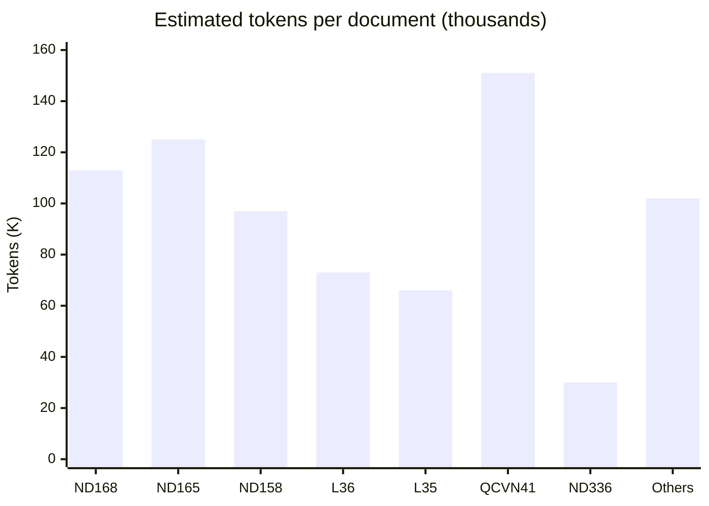

Each document is parsed into a legal-unit hierarchy: article -> clause -> point. Clause-level chunks (2,853) are the primary retrieval granularity; point-level chunks (3,558) add finer precision. ND 168/2024 appears in 106 of 145 (73%) eval questions.

### 2.2 QA training data

QA pairs were generated with `src/generate_qa.py` using Gemini 2.0 Flash served via OpenRouter. Generation was steered by traffic-specific topics (sanctions, procedures, definitions, driver-licence rules, health standards, etc.) and checked against the source documents for factuality.

| file | rows | purpose |
|---|---|---|
| `data/qa_pairs_traffic.jsonl` | 2,885 | raw generator output |
| `data/qa_pairs_traffic_filtered.jsonl` | 2,202 | after similarity dedup, template/length filter |
| `data/splits_filtered/qa_train.jsonl` | 1,762 | train split (80%, seed 42) |
| `data/splits_filtered/qa_dev.jsonl` | 220 | dev split (10%) |
| `data/splits_filtered/qa_test.jsonl` | 220 | test split (10%) |

Each row carries `question`, `answer`, `context` (the source legal passage), `article`, `doc_id`, `title`, `source_path`, `corpus` (one of `local_text`, `negative`, `hard_context`), and `source_policy`.

### 2.3 Manual evaluation sets

| file | rows | description |
|---|---|---|
| `data/eval_manual_labeled_v5.jsonl` | 145 | main eval set — hand-written questions with **gold article, clause, point, and fine amounts** |
| `data/eval_mc_manual.jsonl` | 201 | multiple-choice set (4-option, A/B/C/D) |

**Eval set composition** (v5, 145 rows):

- 15 penalty questions (specific fine amounts), 15 procedure, 5 definition, 105 general, 5 unsupported.
- 106 rows (73%) reference Nghị định 168/2024.
- 126 rows (87%) have gold clause labels; 65 (45%) have gold point labels; 95 (66%) have gold fine amounts; 97 (67%) specify a vehicle type.
- Mean answer length: 131 characters (median 114, max 498).
- This labelling enables *clause-level and fine-amount* recall metrics, which the standard ROUGE/ BLEU suite cannot capture.

### 2.4 Data pipeline overview

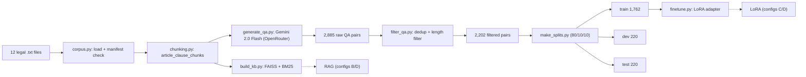

**Legal-unit extraction.** `src/legal_units.py` parses every document into a hierarchy of `article → clause → point` units and saves them to `data/legal_units.jsonl` (6,765 units total: 621 articles, 2,586 clauses, 3,558 points). These units are used by the second-stage legal-unit retriever and for diagnostics, though the live vector DB uses clause-level and point-level chunks directly.

### 2.5 QA generation details and system prompts

QA pairs were generated by `src/generate_qa.py` using **Gemini 2.0 Flash** via OpenRouter. Each source chunk was passed to the model with a topic-specific system prompt. There are 7 prompt templates:

**General** (base prompt, 80% of chunks):
> *System: Bạn là chuyên gia pháp luật giao thông đường bộ Việt Nam. Nhiệm vụ: đọc đoạn văn bản luật giao thông và sinh 1 cặp câu hỏi - câu trả lời bằng tiếng Việt. Câu hỏi phải có thể trả lời được từ đoạn văn bản. Câu trả lời phải bám sát và ưu tiên trích gần nguyên văn từ đoạn văn bản. Không suy diễn, không thêm nội dung không có trong đoạn văn, không thay đổi chủ thể. Ưu tiên nêu văn bản, điều/khoản/điểm nếu đoạn văn có thông tin đó. Chỉ trả về JSON, không giải thích thêm. Format: {"question": "...", "answer": "..."}*

**Penalty** (for sanction-bearing clauses):
> *System: ...sinh 1 cặp câu hỏi - câu trả lời về XỬ PHẠT VI PHẠM... Câu trả lời phải nêu đủ mức phạt tiền, hình thức xử phạt bổ sung, mức trừ điểm/tước GPLX nếu đoạn văn có quy định. Format: {"question": "...", "answer": "..."}*

**Scenario** (for real-world situation questions):
> *System: ...sinh cặp câu hỏi dạng TÌNH HUỐNG THỰC TẾ... Câu hỏi phải mô tả tình huống cụ thể; câu trả lời phải nêu cách xử lý hoặc mức xử phạt đúng theo đoạn văn.*

**Negative** (post-generation, pairs a question with a wrong document):
> *Pairs an existing question with a random different document. Answer: "Tôi không tìm thấy căn cứ trong các văn bản giao thông đã được cung cấp để trả lời câu hỏi này." (Corpus: negative — teaches refusal)*

Other prompt types: **Definitions** (khái niệm), **Procedures** (điều kiện/thủ tục), **Prohibited Acts** (hành vi bị cấm), **Realistic** (colloquial phrasing). Full prompts in `src/generate_qa.py` lines 61–111.

### 2.6 QA training examples

> **Example 1 — Definition (luat_35_2024_qh15, Điều 39)**
> Q: Công trình kiểm soát tải trọng xe dùng để làm gì?
> A: Công trình kiểm soát tải trọng xe để xác định tải trọng trục xe... (Điều 39.4.a).
> *Corpus: local_text*

> **Example 2 — Penalty scenario (nd_168_2024_nd_cp, Điều 32)**
> Q: Tôi đã tự ý lắp thêm cơ cấu nâng hạ thùng xe. Nếu bị phát hiện, tôi bị xử phạt thế nào?
> A: Phạt tiền từ 130.000.000 đồng đến 150.000.000 đồng.
> *Corpus: local_text*

> **Example 3 — Fine amount (nd_168_2024_nd_cp, Điều 14)**
> Q: Mức phạt tiền đối với hành vi điều khiển xe mô tô không có gương chiếu hậu là bao nhiêu?
> A: Phạt tiền từ 400.000 đồng đến 600.000 đồng.
> *Corpus: local_text*

> **Example 4 — Negative (refusal training)**
> Q: [any question] paired with a wrong document.
> A: "Tôi không tìm thấy căn cứ trong các văn bản giao thông đã được cung cấp..."
> *Corpus: negative — teaches selective reading + refusal*

---

## 3. Overall Architecture

The system has three layers that are independently measurable:

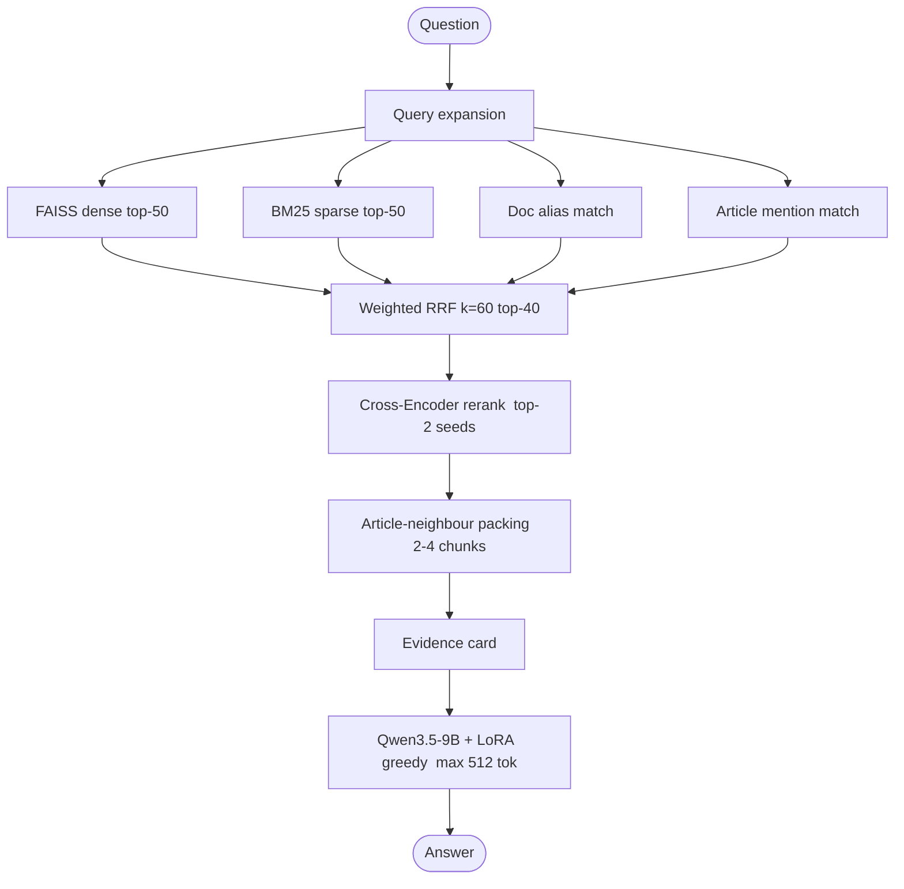

| Config | A | B | C | **D** |
|---|---|---|---|---|
| Retrieval | no | yes | no | yes |
| LoRA | no | no | yes | yes |

### 3.1 Cross-Encoder rerank as a modular second stage

The cross-encoder (`BAAI/bge-reranker-v2-m3`, 568M params) is a separate module that takes the top-40 RRF-scored chunks and re-ranks them with a transformer that ingests the query *jointly* with each passage. Unlike the dense embedding stage, this lets the model attend to cross-interactions between query terms and passage terms — critical for clause discrimination where "người điều khiển xe ô tô" vs "người điều khiển xe mô tô" determine which article applies.

We keep the pretrained CE because its multilingual training already covers Vietnamese well enough; a fine-tuned sibling (`models/bge-reranker-v2-m3-traffic-ft`) was tested early and under-performed due to a tiny (69-sample) and unrepresentative dev set.

### 3.2 Adapter toggle

In production (the Gradio demo and the eval runner), the LoRA-attached model is loaded **once**. For configs A and B we call `model.disable_adapter()` to get base-model behaviour; for C and D we keep the adapter enabled. This avoids the OOM caused by swapping two 4-bit models on a 16 GB card.

---

## 4. Deep Dive: The RAG System

The RAG pipeline converts a user question into a grounded legal answer through six sequential stages. Every stage below is illustrated with a single running example traced end-to-end.

> **Running example:** *"Người điều khiển ô tô vượt đèn đỏ bị phạt bao nhiêu tiền?"*

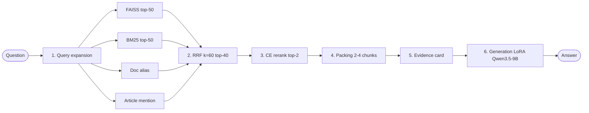

---

### Stage 1: Query expansion

`expand_query_generic()` (`src/retrieval_v4.py`) applies a fixed lexical normalisation table. Expansions are **purely surface-level** — they never map a phrase to a specific article or legal provision.

| Surface form in query | Term added to query |
|---|---|
| `ô tô` | `xe hơi xe ô tô` |
| `xe máy` | `xe mô tô xe gắn máy` |
| `mức phạt` / `bị phạt` | `xử phạt phạt tiền` |
| `gplx` | `giấy phép lái xe` |
| `nđ` / `nd` | `nghị định` |

**Running example:**

```
Input:  "Người điều khiển ô tô vượt đèn đỏ bị phạt bao nhiêu tiền?"

Output: "Người điều khiển ô tô vượt đèn đỏ bị phạt bao nhiêu tiền?
         xe hơi xe ô tô xử phạt phạt tiền"
```

The expanded string is passed to both FAISS and the cross-encoder, so the legal vocabulary (`phạt tiền`) reaches both retrieval stages.

> **Ablation (n=30):** disabling query expansion costs **0.7 pp R-L** (0.446→0.439). The effect is expected to be larger on tail queries that use abbreviations (`gplx`, `nđ`) absent from chunk text.

---

### Stage 2: Hybrid retrieval (4 rank lists → RRF)

Four independent rank lists are computed, then fused with Weighted Reciprocal Rank Fusion:

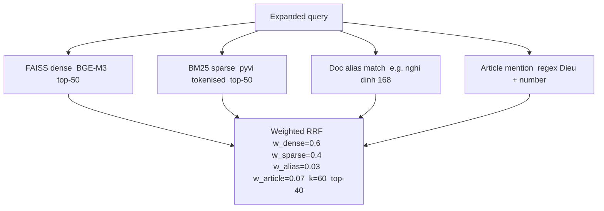

**Running example — what each source returns:**

| Source | What it finds for "vượt đèn đỏ bị phạt bao nhiêu?" |
|---|---|
| FAISS | Chunks about "điều khiển xe ô tô", "đèn tín hiệu giao thông", "phạt tiền" — semantic match |
| BM25 | Exact match on "phạt", "tiền", "ô tô" — but misses "vượt đèn đỏ" since legal text says "không chấp hành hiệu lệnh của đèn tín hiệu giao thông" |
| Doc alias | No doc number or alias in query → empty list |
| Article mention | No "Điều X" in query → empty list |
| RRF | Dense and BM25 fused; Điều 6 khoản 9 chunks bubble up because they appear in both lists |

> **Ablation (n=30):**
>
> | Config | R-L | METEOR | F1-tok |
> |---|---|---|---|
> | Full hybrid (baseline) | 0.446 | 0.318 | 0.351 |
> | Dense + BM25 only | 0.446 | 0.318 | 0.351 |
> | Dense FAISS only | 0.442 | 0.311 | 0.344 |
>
> BM25 adds ~0.4 pp R-L over dense alone. Doc alias and article mention show no measurable effect on this 30-sample test set — most questions do not cite a document number or an explicit article reference.

---

### Stage 3: Cross-Encoder (CE) rerank

The top-40 RRF candidates are re-scored by `BAAI/bge-reranker-v2-m3` (568M params). Unlike the bi-encoder (FAISS), the CE reads query and passage **jointly** through a single transformer — allowing cross-attention between query tokens and passage tokens.

| Rank | Chunk | CE score |
|---|---|---|
| **1** | Điều 6 khoản 9 điểm b | **0.94** |
| 2 | Điều 6 khoản 5 điểm b | 0.71 |
| 3 | Điều 9 khoản 1 | 0.38 |
| … | 37 more pairs | … |

CE keeps top-12. `retrieve_ranked_docs` returns top-8, caller slices to top-2 seeds for packing.

**Why CE is essential:** BM25 cannot bridge "vượt đèn đỏ" (colloquial) → "không chấp hành hiệu lệnh của đèn tín hiệu giao thông" (legal). The CE attends to both strings jointly and learns the semantic correspondence, pushing the correct clause to rank 1.

> **Ablation (n=30):** removing CE drops R-L by **2.1 pp**, METEOR by **2.2 pp**, F1 by **2.5 pp** — the **largest single-component degradation** in the entire pipeline.

---

### Stage 4: Article-neighbour packing

`pack_article_context()` (`src/context_packing.py`) takes the top-2 CE seeds and adds sibling chunks that share the same `(doc_id, article_number)` key, up to a maximum of 4 chunks.

**CE top-2 seeds:**

| # | doc | Điều | khoản | note |
|---|---|---|---|---|
| Seed 1 | nd_168 | 6 | 9 | phạt 18–20M, điểm b = đèn đỏ |
| Seed 2 | nd_168 | 6 | 8 | gây tai nạn không dừng xe |

**After packing** (radius=1, max 4 chunks):

| Slot | chunk | relation |
|---|---|---|
| 1 | Điều 6 khoản 9 | seed |
| 2 | Điều 6 khoản 8 | seed |
| 3 | Điều 6 khoản 10 | same-article neighbour of seed 1 |
| 4 | *(budget full)* | — |

**Why this helps:** the CE ranks the clause that names the violation behaviour highest, but the fine amount can be in the clause header while the specific violation is in a sub-point. Packing ensures the model sees the governing sanction paragraph together with the individual violation description.

> **Ablation (n=30):** taking top-4 directly from CE (no packing) gives R-L 0.450 vs 0.446 for packing. The difference is within noise at n=30. Packing is expected to help more for questions where the fine amount and the specific violation live in adjacent clauses of the same article.

---

### Stage 5: Evidence-card formatting

`evidence_card_from_text()` (`src/evidence_cards.py`) applies structure-aware regex over each packed chunk to extract a compact structured card. The extractor is **question-agnostic** — it always pulls `Điều`, `khoản`, `điểm`, `phạt tiền từ … đến`, `trừ điểm`, `tước` from the raw text.

**Input (raw legal chunk):**

```
Điều 6. Xử phạt, trừ điểm giấy phép lái xe của người điều khiển xe ô tô...

9. Phạt tiền từ 18.000.000 đồng đến 20.000.000 đồng đối với người điều khiển
xe thực hiện một trong các hành vi vi phạm sau đây:
b) Không chấp hành hiệu lệnh của đèn tín hiệu giao thông;
```

**Output (evidence card appended to LLM prompt):**

```
EVIDENCE_CARD
Căn cứ: nd_168_2024_nd_cp Điều 6 khoản 9 điểm b
Điều luật: Điều 6. Xử phạt, trừ điểm giấy phép lái xe...
Mức phạt: phạt tiền từ 18.000.000 đồng đến 20.000.000 đồng
Kết luận tiền phạt: phạt tiền từ 18.000.000 đồng đến 20.000.000 đồng
Hành vi/điều kiện liên quan: b) Không chấp hành hiệu lệnh của đèn tín hiệu giao thông;
Chỉ trả lời bằng kết luận ngắn gọn từ các trường trên; không chép lại thẻ.
```

> **Ablation (n=30):** removing evidence card causes R-L to fall **5.6 pp** (0.446→0.390) while METEOR rises 7.9 pp. Without the card the model writes longer, more verbose answers (higher recall → higher METEOR) but loses answer precision (lower R-L). More critically, the forbidden-legacy citation rate jumps from **0.000 to 0.033** — the structured citation anchor suppresses references to superseded decrees that the model otherwise pulls from parametric memory.

---

### Stage 6: Generation with LoRA

The packed chunks and evidence cards are assembled into the final prompt:

**Prompt structure:**

| Role | Content |
|---|---|
| system | "Bạn là chuyên gia pháp luật giao thông... Nếu thẻ có Mức phạt, hãy trả lời ngay mức phạt trong thẻ..." |
| user | Đoạn luật liên quan: *[4 packed chunks + evidence cards]* |
| user | Câu hỏi: Người điều khiển ô tô vượt đèn đỏ bị phạt bao nhiêu tiền? |

Decoding: `do_sample=False`, `max_new_tokens=512`, `repetition_penalty=1.08`.

**Model output:**

> Người điều khiển ô tô không chấp hành hiệu lệnh của đèn tín hiệu giao thông (vượt đèn đỏ) bị phạt tiền từ 18.000.000 đồng đến 20.000.000 đồng, căn cứ Điều 6, khoản 9, điểm b Nghị định 168/2024/NĐ-CP.

### 4.1 Chunking strategy — evolution and impact

The chunking strategy was the single largest performance lever discovered during this project.

| policy | description | chunks | clause_recall | context_recall@5 | ROUGE-L (D) |
|---|---|---|---|---|---|
| `article_v2` | 1 chunk per article (~1600 chars) | 1,597 | 0.00 | 0.525 | 0.327 |
| `article_clause_v3` | 1 chunk per clause + article header | 2,853 | **0.81** | **0.975** | **0.515** |
| `article_clause_point_v4` | + point chunks for dense clauses (>=2 points, >=400 chars) | 5,931 | 0.81 | 0.975 | 0.510 |

**Concrete example — same source text, three chunk granularities:**

Source: NĐ 168/2024, Điều 6, khoản 9, điểm b (the "vượt đèn đỏ" clause for ô tô):

**v2 — article-level** (1 chunk = entire Điều 6, ~3,500 chars)

```
Điều 6. Xử phạt, trừ điểm giấy phép lái xe của người điều khiển xe ô tô...

1. Phạt tiền từ 400.000 đồng đến 600.000 đồng đối với...
   a) Không chấp hành hiệu lệnh, chỉ dẫn của biển báo hiệu...
   b) Khi ra, vào vị trí dừng xe, đỗ xe không có tín hiệu...
2. Phạt tiền từ 600.000 đồng đến 800.000 đồng đối với...
   ...   [khoản 3–8: 9 more fine brackets, ~50 violation behaviors]
9. Phạt tiền từ 18.000.000 đồng đến 20.000.000 đồng...    ← buried here
   b) Không chấp hành hiệu lệnh của đèn tín hiệu giao thông;
```

> **Result:** Embedding dominated by title + khoản 1. Dense retriever cannot distinguish khoản 9 from khoản 3. `clause_recall = 0.00`

---

**v3 — clause-level** (1 chunk = khoản 9, ~180 chars)

```
Điều 6. Xử phạt, trừ điểm giấy phép lái xe của người điều khiển xe ô tô...

9. Phạt tiền từ 18.000.000 đồng đến 20.000.000 đồng đối với người điều
   khiển xe thực hiện một trong các hành vi vi phạm sau đây:
   a) Điều khiển xe trên đường mà trong máu hoặc hơi thở có nồng độ cồn...
   b) Không chấp hành hiệu lệnh của đèn tín hiệu giao thông;
   c) Không chấp hành hiệu lệnh, hướng dẫn của người điều khiển giao thông...
   d) Đi ngược chiều của đường một chiều...
```

> **Result:** This chunk is indexed separately. Query "vượt đèn đỏ" now has a dedicated vector with the right fine bracket. `clause_recall` jumps to **0.81**.

---

**v4 — point-level** (1 additional chunk = khoản 9, điểm b only)

```
Điều 6. Xử phạt, trừ điểm giấy phép lái xe của người điều khiển xe ô tô...

Khoản 9. Phạt tiền từ 18.000.000 đồng đến 20.000.000 đồng đối với...

b) Không chấp hành hiệu lệnh của đèn tín hiệu giao thông;
```

> **Result:** A laser-focused chunk: one violation, one fine bracket. Useful when the query asks about one behavior among several in the clause. Recall unchanged (0.81) — the clause chunk already covers it — but helps CE discriminate within a clause when needed.

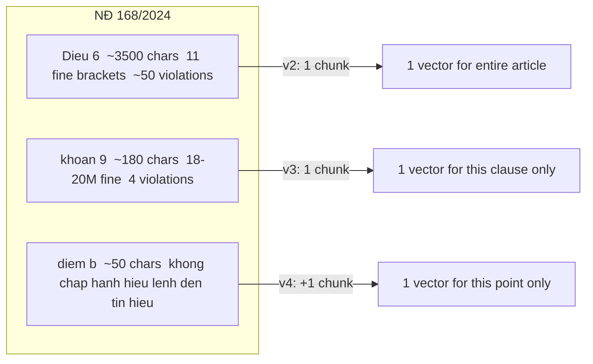

**Why article-level fails:** the Điều 6 embedding is dominated by the article title and khoản 1. The dense retriever cannot distinguish khoản 9 (18-20M fine) from khoản 3 (800K-1M fine) because their position in the 3,500-char block is too similar vectorially.

**Why point chunks add less than expected:** the clause chunk already embeds the clause headline (`Phạt tiền từ 18.000.000 đồng...`), which carries the answer. Point chunks help edge cases where four violations in one clause have different penalties, but they double the search space (2,853→5,931), slightly diluting the top-5 ranking.

### 4.2 Embedding model

| model | params | training | used in |
|---|---|---|---|
| `BAAI/bge-m3` | 570M | multilingual pretrain, 102 languages | initial KB |
| `models/bge-m3-traffic-ft` | 570M | MNR fine-tune on 1,762 traffic pairs, 3 epochs | **current KB** |

**Why fine-tune?** Two clauses in the same article share the same header text and differ only in the fine amount — base `bge-m3` produces nearly identical embeddings for them. The fine-tune teaches the model to bridge colloquial queries (*"vượt đèn đỏ"*) to legal clause vocabulary (*"không chấp hành hiệu lệnh đèn tín hiệu"*).

#### Training data construction

Two sources are combined, each built differently:

| Source | Pairs | Hard negatives |
|---|---|---|
| `qa_train.jsonl` — procedure QA | ~1,542 | none (LLM-generated Q/A, diverse topics) |
| `penalty_training_pairs.jsonl` — penalty QA | ~220 | yes — same article, different fine bracket |

**Procedure pairs** come directly from the QA generation pipeline (`generate_qa.py`): the LLM writes a question and the source clause is the positive. No extra processing needed.

**Penalty pairs** are synthetically constructed from `legal_sanction_facts.jsonl` — a structured table parsed from every sanction clause in NĐ 168/2024, with fields: `citation`, `violation_text`, `fine_text`, `points_deducted`, `suspension_text`, `vehicle_scope`. The construction pipeline (`generate_penalty_pairs.py`) works as follows:

```
legal_sanction_facts.jsonl
  └─ filter: answer_ready=True AND fine_text present
       └─ for each fact → generate 3–5 question variants via templates
       └─ build context: citation + violation_text + fine_text + points_deducted
       └─ find hard negatives: same article_number, different clause_number
```

**Concrete example — one penalty training triplet:**

```
anchor (question):
  "Điều khiển ô tô vượt đèn đỏ bị phạt bao nhiêu tiền?"

positive (clause chunk for khoản 9):
  nd_168_2024_nd_cp Điều 6 khoản 9
  9. Phạt tiền từ 18.000.000 đồng đến 20.000.000 đồng đối với người điều
  khiển xe thực hiện một trong các hành vi vi phạm sau đây:
  b) Không chấp hành hiệu lệnh của đèn tín hiệu giao thông;
  Mức phạt: phạt tiền từ 18.000.000 đồng đến 20.000.000 đồng
  Trừ điểm: 02 điểm giấy phép lái xe

hard negative (khoản 1 — same article, different fine bracket):
  nd_168_2024_nd_cp Điều 6 khoản 1
  1. Phạt tiền từ 400.000 đồng đến 600.000 đồng đối với người điều
  khiển xe thực hiện một trong các hành vi vi phạm sau đây:
  a) Không chấp hành hiệu lệnh, chỉ dẫn của biển báo hiệu, vạch kẻ đường...
  Mức phạt: phạt tiền từ 400.000 đồng đến 600.000 đồng
```

Both the positive and the hard negative share the same article title. The only distinguishing signal is the fine bracket and the specific violation list — exactly what the embedder must learn to separate.

#### MultipleNegativesRankingLoss

For a batch of $B$ pairs, the model embeds all anchors and all positives in one forward pass. For each anchor $q_i$, every other positive in the batch acts as a free in-batch negative. The loss is InfoNCE-style:

$$L = -\log \frac{\exp\!\left(\operatorname{sim}(q_i,\, p_i)/\tau\right)}{\displaystyle\sum_{j=1}^{B} \exp\!\left(\operatorname{sim}(q_i,\, p_j)/\tau\right)}$$

where $\tau$ is a learned temperature and $\operatorname{sim}$ is cosine similarity. Intuitively: the loss pushes $q_i$ closer to its paired $p_i$ and simultaneously further from all other $p_j$ in the batch. No manual labeling is needed — the pairing itself provides the supervision signal.

For penalty pairs, the explicit hard negative is appended to the denominator alongside the in-batch negatives:

$$\sum_{j=1}^{B} \exp(\cdot) \;\longrightarrow\; \sum_{j=1}^{B} \exp(\cdot) + \exp\!\left(\operatorname{sim}(q_i,\, n_i)/\tau\right)$$

This increases the penalty specifically when the model confuses the correct clause with the same-article confusable one, forcing it to attend to fine amount differences.

| Hyperparameter | Value |
|---|---|
| Epochs | 3, early-stop on `recall@3` |
| Effective batch | 32 (4 per device × 8 grad accum) |
| Learning rate | 2e-5, 10% warmup |
| Max seq length | 256 tokens |
| Precision | fp16 + gradient checkpointing |

**Effect:** `source_recall@5` improved **0.91 → 0.96**.

### 4.3 Retrieval recall metrics

Measured over 145 annotated questions (`eval_manual_labeled_v5.jsonl`).

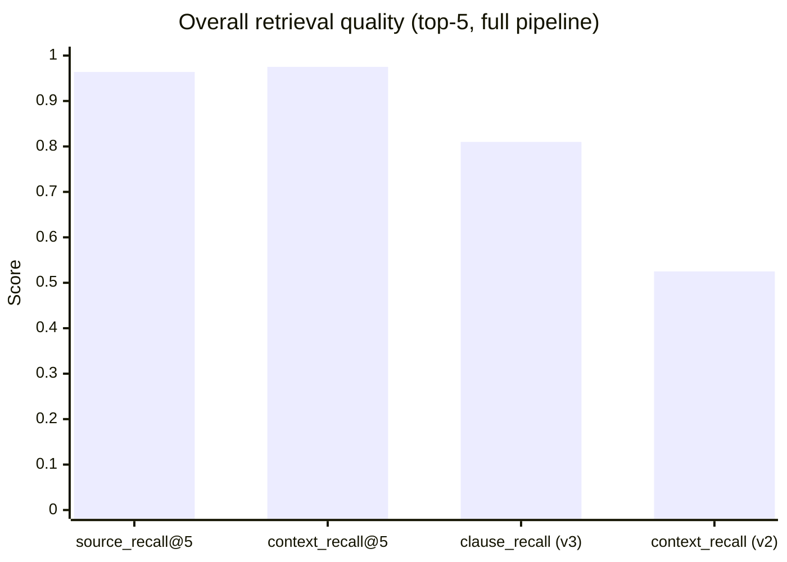

`source_recall@5` — expected source document appears in top-5. `context_recall@5` — a chunk containing the answer text appears in top-5. `context_recall` slightly exceeds `source_recall` because a chunk from a different document that happens to contain the answer string still counts. The last two bars show the jump from article-level (v2) to clause-level (v3) chunking — the single highest-leverage change in the pipeline.

---

### 4.4 Component ablation

Config D (LoRA + RAG), 30 samples, seed 42. Each row removes exactly one component.

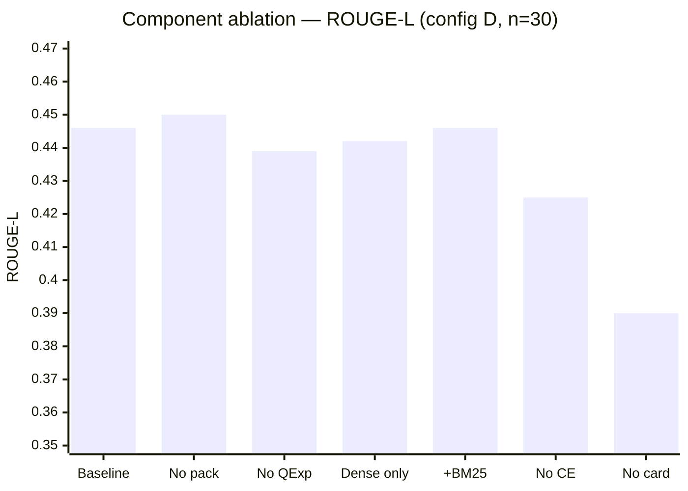

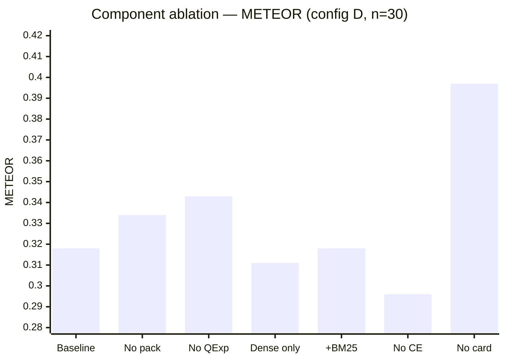

**Key findings:**

- **CE rerank** — largest consistent drop when removed (R-L −2.1 pp, METEOR −2.2 pp, F1 −2.5 pp). Most important single component.
- **Evidence card** — asymmetric: removing it raises METEOR +7.9 pp (longer, more verbose answers) but drops R-L −5.6 pp and sends legacy citation rate from **0.000 → 0.033**. The card anchors the model to current law; without it the model cites superseded decrees from parametric memory.
- **BM25** — small consistent gain (~0.4 pp R-L). Alias and article-mention signals show no measurable effect on this 30-sample set.
- **Packing vs top-4 from CE** — top-4 straight from CE marginally outperforms packing (+0.4 pp R-L) at n=30. Inconclusive; larger evaluation needed.
- **Query expansion** — negligible at n=30 (−0.7 pp R-L); may matter for tail queries with atypical vocabulary.

---

## 5. Fine-Tuning Setup

The LoRA adapter was trained **once** at the beginning using the same training data and config. It was not retrained after any retrieval or chunking changes.

| parameter | value |
|---|---|
| base model | `Qwen/Qwen3.5-9B` (4-bit NF4, unsloth) |
| LoRA rank | 32 |
| LoRA alpha | 64 |
| target modules | `q_proj, k_proj, v_proj, o_proj, gate_proj, up_proj, down_proj` |
| learning rate | 5e-5 |
| epochs | 2 |
| batch size / grad accum | 2 / 8 → effective 16 |
| scheduler | cosine, warmup 5% |
| context keep probability | 0.9 (90% of rows include the legal context) |
| max sequence length | 2,048 |
| train data | 1,762 rows (`qa_train.jsonl`) |
| dev data | 220 rows (`qa_dev.jsonl`) |

**Why `CONTEXT_KEEP_PROB=0.9` matters:** the model is trained with the legal passage in the prompt 90% of the time and asked to answer without it 10% of the time. This means configs C (no RAG) and D (with RAG) share the same adapter and the C↔D distribution shift is small.

---

## 6. Evaluation Protocol

### 6.1 Quantitative metrics

| metric | implementation | what it captures |
|---|---|---|
| ROUGE-1/2/L | `rouge_score` (no stemming) | n-gram recall against the reference answer |
| BLEU-4 | `sacrebleu` (13a tokeniser) | corpus-level n-gram precision |
| METEOR | `nltk.translate.meteor_score` | unigram F1 with synonym/stemming |
| F1-token | custom word-level F1 (SQuAD-style) | partial-credit answer matching |
| BERTScore-F1 | `vinai/phobert-base-v2` (manual cos-sim) | semantic similarity; max-length 254 to avoid RoBERTa position-buffer bug |
| Exact Match | strict string equality | sanity check |
| Forbidden-legacy rate | keyword scan (NĐ 100/2019, Luật GTĐB 2008, drafts, …) | hallucination to repealed laws |
| False-refusal rate | keyword scan on supported-category questions | incorrect "I cannot answer" responses |
| Source hit rate / Recall@5 | `expected_doc_ids` match in top-5 retrieved | source-level retrieval |
| Article / clause / point recall | gold labels in `eval_manual_labeled_v5` | structural retrieval precision |

### 6.2 LLM-Judge

An external LLM (`google/gemini-2.0-flash-001` via OpenRouter) scores each prediction on a 1–5 Likert scale against the reference answer. The judge prompt is standardised in Vietnamese. Score is normalised to [0, 1] for comparability with the other metrics.

**Why include a judge:** ROUGE/METEOR reward surface overlap but do not distinguish "wrong because the model hallucinated a number" from "right number, different phrasing." The judge is consistently closer to factual accuracy on the scored subset.

---

## 7. Results

### 7.1 RAG and LoRA contributions

Each config adds exactly one component to the previous. This isolates what RAG and LoRA each contribute:

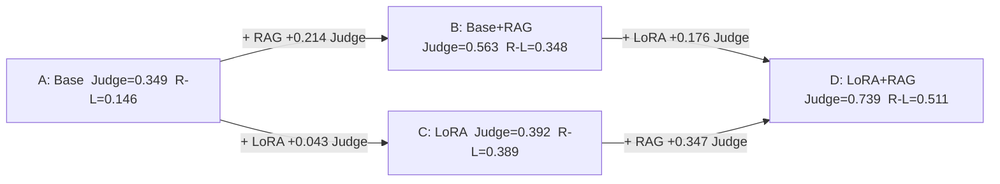

| | RAG contribution (no LoRA) | RAG contribution (with LoRA) |
|---|---|---|
| ROUGE-L | +0.202 (A→B) | +0.122 (C→D) |
| LLM-Judge | +0.214 (A→B) | +0.347 (C→D) |

| | LoRA contribution (no RAG) | LoRA contribution (with RAG) |
|---|---|---|
| ROUGE-L | +0.243 (A→C) | +0.163 (B→D) |
| LLM-Judge | +0.043 (A→C) | +0.176 (B→D) |

**Insight — LoRA and RAG are synergistic on Judge but additive on ROUGE-L.** The combined D gain on Judge (0.739) is larger than A+RAG+LoRA individually would predict, because LoRA teaches the model to cite correctly *and* RAG provides the correct number to cite.

---

### 7.2 Full metric table (145 samples)

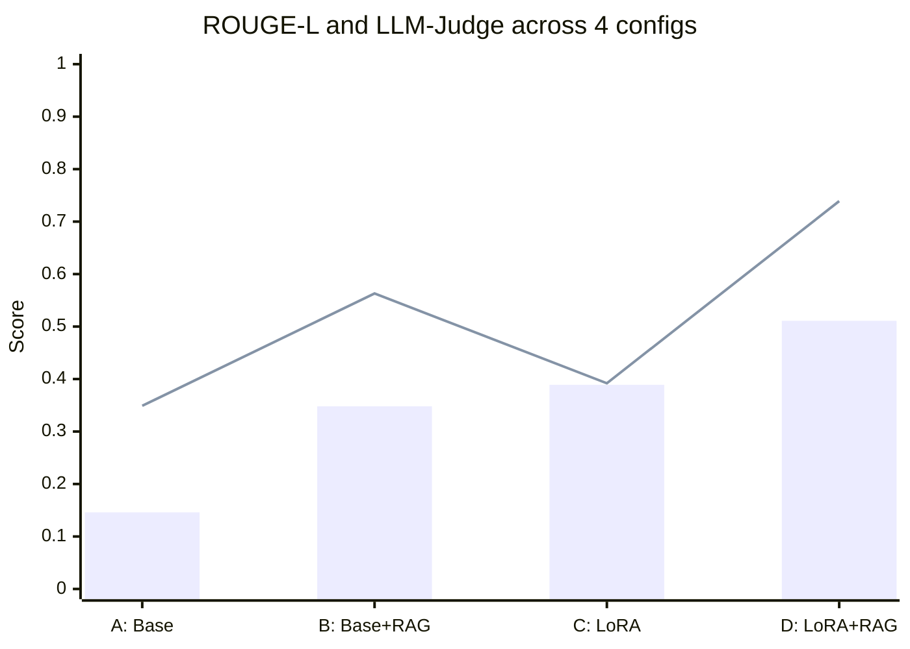

*Bars = ROUGE-L  |  Line = LLM-Judge*

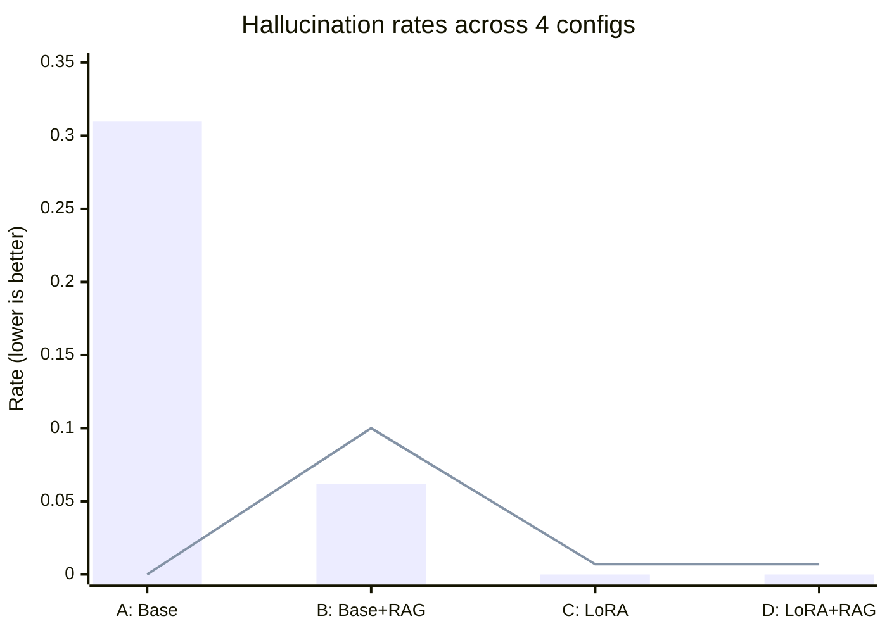

*Bars = forbidden-legacy citation rate  |  Line = false-refusal rate*

| metric | A (base) | B (base+RAG) | C (LoRA) | **D (LoRA+RAG)** |
|---|---|---|---|---|
| ROUGE-L | 0.146 | 0.348 | 0.389 | **0.511** |
| ROUGE-1 | 0.188 | 0.444 | 0.533 | **0.573** |
| ROUGE-2 | 0.116 | 0.290 | 0.308 | **0.445** |
| BLEU-4 | 0.019 | 0.079 | 0.146 | **0.364** |
| METEOR | 0.257 | 0.420 | 0.410 | **0.471** |
| F1-token | 0.127 | 0.308 | 0.359 | **0.416** |
| BERTScore-F1 | 0.548 | 0.607 | 0.638 | **0.690** |
| LLM-Judge | 0.349 | 0.563 | 0.392 | **0.739** ★ |
| source_recall@5 | — | 0.964 | — | 0.964 |
| context_recall@5 | — | 0.975 | — | 0.975 |
| false_refusal | 0.000 | 0.100 | 0.007 | **0.007** |
| forbidden_legacy | 0.310 | 0.062 | 0.000 | **0.000** |

---

### 7.3 Key observations

**1. The ordering A < B < C < D holds on almost every metric.** RAG alone more than doubles ROUGE-L for the base model (0.146→0.348). LoRA alone adds similar R-L gain. Combining both reaches 0.511.

**2. LoRA alone (C) scores surprisingly low on LLM-Judge (0.392) — lower than base+RAG (B at 0.563).** C generates fluent, legal-sounding answers but memorises training-set fine amounts. If the correct amount differs, the answer fails factual verification. B, despite rougher style, copies numbers directly from retrieved chunks and gets them right.

**3. D combines B's factual grounding with C's fluency.** The Judge score of 0.739 reflects this: the model cites the right clause, quotes the right amount, and writes in natural Vietnamese.

**4. Legacy citation is solved by LoRA.** Config A (base model, no RAG) cites superseded decrees in 31% of answers. Config B halves this to 6.2% by providing a retrieved context that mentions the current law. LoRA (C, D) eliminates it entirely — the adapter was trained with an explicit system prompt that forbids legacy citations.

---

## 8. Error Analysis

On the best config D with 145 samples:

| bucket | count | share |
|---|---|---|
| Correct (R-L ≥ 0.6) | ≈60 | 41% |
| Partial (0.3–0.6) | ≈60 | 41% |
| Wrong (R-L < 0.3) | ≈20 | 14% |
| Refused | 1 | 0.7% |

**Persistent failure patterns:**

1. **Clause-ambiguity for sanctions with similar surface form.** "Vượt đèn đỏ" retrieves "vượt xe" clauses if the CE is not given the expanded form.

2. **Off-domain "leakage."** Some eval questions labelled with `expected_doc_ids=[nd_168_2024_nd_cp]` are actually about topics outside the corpus (e.g. household business registration). The retrieval system brings back NĐ 168 text on a vaguely matching keyword, but the answer is wrong.

3. **Number-format fragility.** Even with `no_repeat_ngram=0`, the model occasionally collapses digits (e.g. "6.001.000" for "6.000.000") on very long fine-amount strings. This is a known Qwen3 tokenisation artefact and is mitigated but not eliminated.

---

## 9. Demo

`src/app.py` serves a Gradio interface at `http://localhost:7860`.

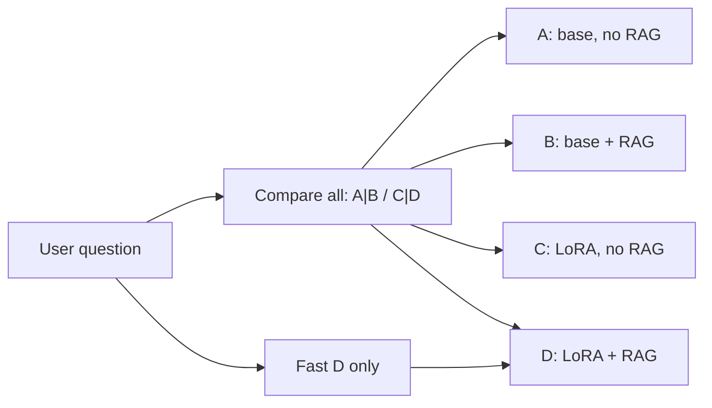

**Key demo features:**

- One question produces **4 answers side-by-side** (A | B / C | D) so the user can directly compare.
- D is highlighted as the recommended config.
- A live status line shows which model is loading or generating.
- The RAG context accordion shows the exact legal passage used.
- A "fast" button runs only config D (~30 s cold, ~8 s per subsequent question).
- The VRAM-friendly adapter-toggle design loads the model only once and toggles the LoRA adapter on/off via PEFT, avoiding the swap-OOM on 16 GB GPUs.

---

## 10. Limitations & Future Work

1. **CE reranker still untuned for Vietnamese legal prose.** A properly formatted clause-level training set (pairing queries with *live KB chunks* rather than synthetic fact-table text) would likely add another 2–3 ROUGE-L points.

2. **Point-level impact.** Point-level chunks added to the KB without degrading retrieval, but the end-to-end gain was small because most fine-bearing clauses contain the fine in the clause lead. For articles where per-point fines differ, point chunks are necessary; the current threshold (≥2 points, ≥400 chars) could be tuned per-document.

3. **Number-format decoding.** A constrained decoding strategy that forces valid number tokens in the "phạt tiền từ … đến …" template would eliminate the remaining ~2% of numeric-format errors without changing the model.

5. **Human evaluation.** A human-graded sample of 50 questions is the most reliable validation of the LLM-Judge numbers and is required by the course specification.

---

## 11. Reproducibility

```bash
cd /home/pc5070ti/workspace/SDA/nlp

# 1. Rebuild the KB with the finetuned embedder and clause+point chunking
EMBED_MODEL=models/bge-m3-traffic-ft python src/build_kb.py --force
python src/sparse_bm25.py build

# 2. Full evaluation of all 4 configs (145 samples)
export OPENROUTER_API_KEY=sk-or-v1-...
python src/evaluate.py --configs A B C D \
  --test-file data/eval_manual_labeled_v5.jsonl

# 3. LLM-Judge
python scripts/llm_judge.py

# 4. Run the demo
python src/app.py
# Open http://localhost:7860
```

All artifacts are versioned on GitHub and the HuggingFace Hub:

| artifact | location |
|---|---|
| code | `github.com/Anakonkai01/nlp-traffic-laws` |
| LoRA adapter (canonical v2) | `huggingface.co/Anakonkai/qwen3.5-9b-lora-traffic-v2` |
| LoRA E v1/v2 (ablation) | `huggingface.co/Anakonkai/qwen3.5-9b-lora-traffic-rag-sft-v{1,2}` |
| Embedder | `huggingface.co/Anakonkai/bge-m3-traffic-ft` |
| Dataset (training + eval) | `huggingface.co/datasets/Anakonkai/nlp-traffic-qa` |

---

*End of report.*
