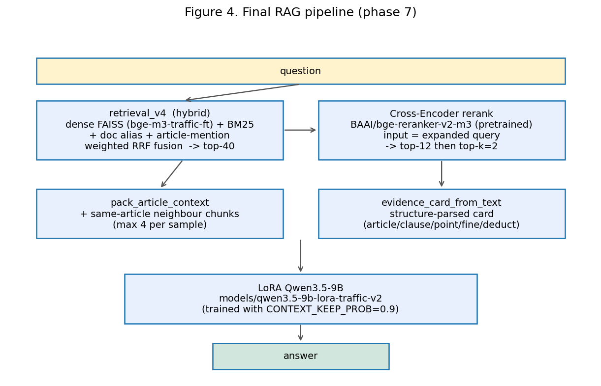
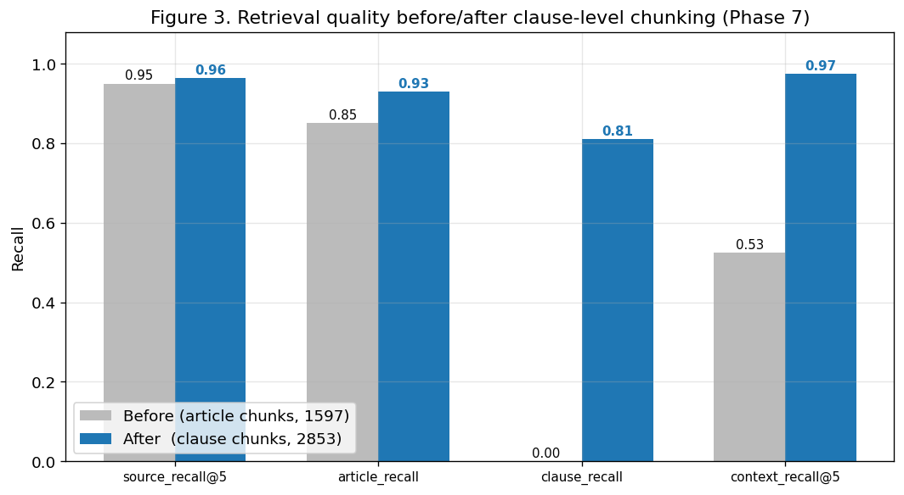
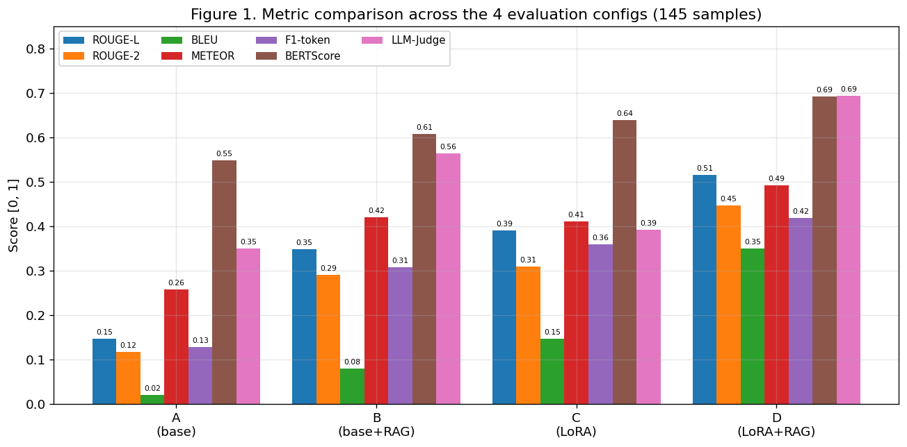
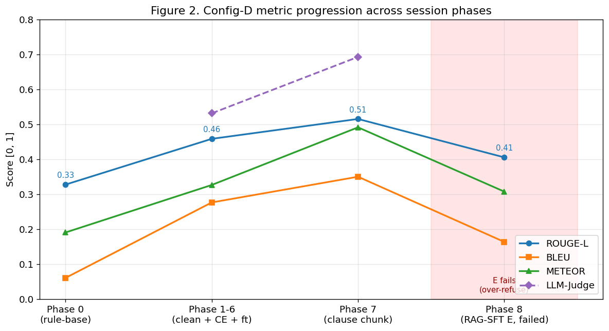
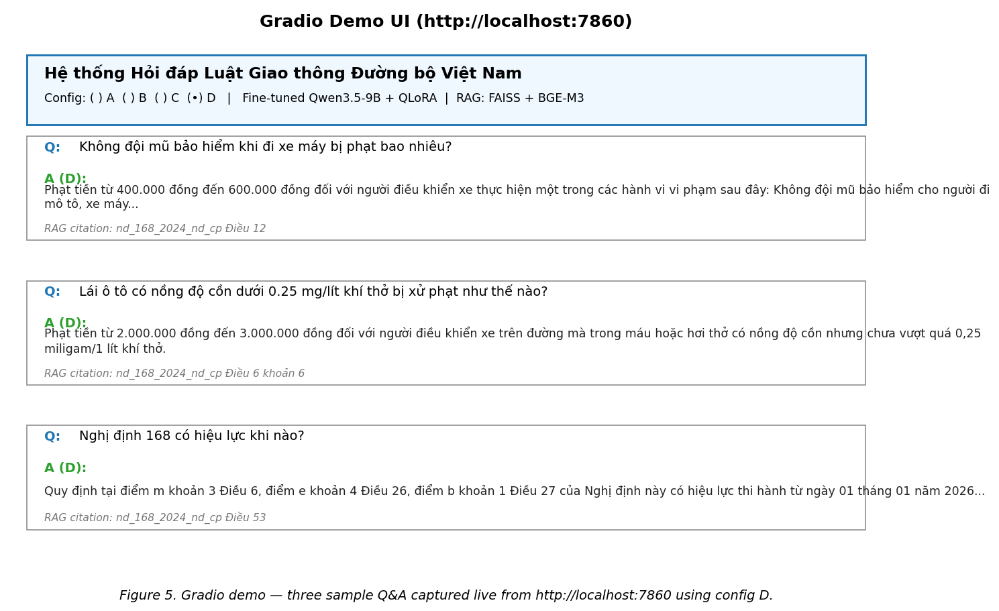

# Vietnamese Traffic-Law QA
## RAG + LoRA fine-tune on Qwen3.5-9B

**Course:** Introductory NLP · Topic 1
**Author:** Anakonkai01
**Date:** 2026-05-11

<!--
Lời người thuyết trình:
Xin chào thầy/cô và các bạn. Hôm nay tôi trình bày đề tài 1 của môn NLP: xây dựng hệ thống Hỏi đáp Luật Giao thông Đường bộ Việt Nam bằng kiến trúc RAG kết hợp LoRA fine-tune trên Qwen3.5-9B. Tôi sẽ trình bày gọn trong khoảng 5 phút, tập trung vào pipeline khoa học và kết quả đo được.
-->

---

# Problem & dataset

- Vietnamese **road-traffic law QA**, local-text-only corpus.
- 12 enabled laws/decrees (Nghị định 168/2024, Luật 35/2024, Luật 36/2024, TT 65/2024, QCVN 41/2024, …).
- **Eval set:** `eval_manual_labeled_v5.jsonl` — 145 hand-labelled questions with gold article / clause / point / fine range.
- **Training set:** `data/splits_filtered/qa_train.jsonl` — 1 762 QA pairs.

<!--
Lời người thuyết trình:
Domain tôi chọn là Luật Giao thông đường bộ Việt Nam, chính sách đọc chỉ đọc file .txt đã được bật trong manifest, không dùng PDF, không crawl. Nguồn gồm 12 văn bản chính: Nghị định 168, Luật Đường bộ, Luật Trật tự an toàn giao thông, các thông tư của Bộ Công An và quy chuẩn biển báo. Bộ test thủ công có 145 câu, được label tay đầy đủ Điều, khoản, điểm, mức phạt để đo chính xác ở cấp điều khoản.
-->

---

# 4 evaluation configs (per đề bài)

| | No RAG | +RAG |
|---|---|---|
| Base LLM | **A** | **B** |
| Fine-tuned LoRA | **C** | **D** |

- A: base Qwen3.5-9B, no retrieval.
- B: base + FAISS retrieval.
- C: LoRA fine-tuned, no retrieval.
- D: **LoRA + full retrieval pipeline** (deliverable).

<!--
Lời người thuyết trình:
Đề bài yêu cầu so sánh 4 cấu hình: A là model gốc không RAG, B model gốc cộng RAG, C là LoRA không RAG, và D là LoRA cộng RAG. D chính là cấu hình sản phẩm, các cấu hình còn lại là ablation để cho thấy từng thành phần đóng góp bao nhiêu.
-->

---

# Final pipeline



<!--
Lời người thuyết trình:
Đây là pipeline cuối. Câu hỏi sau khi chuẩn hoá từ vựng được đưa vào retrieval v4 gồm 4 rank list là dense FAISS trên bge-m3-traffic-ft, BM25, doc-alias và article mention, fusion bằng weighted Reciprocal Rank Fusion. Sau đó Cross-Encoder bge-reranker-v2-m3 rerank top-12 với input là query đã expand, rồi pack thêm các chunk trong cùng article để giữ context pháp lý, cuối cùng evidence_card parse structure rồi đưa vào LoRA Qwen3.5-9B. Lưu ý không có bảng tra cứng phrase thành điều khoản ở bất cứ bước nào.
-->

---

# What I removed (previous AI's rule-base hacks)

- **Phrase → article lookup** (`VEHICLE_ARTICLE_MAP`): "xe máy" → nd_168 Điều 7, hard-coded.
- **Severity regex → clause table** (75 lines): alcohol / speed / red-light / helmet mapped to fixed (article, clause).
- **CE-bypass structured fact injection**: hand-picked 1 card, fed to LLM.
- **Regex "direct answer" that bypassed the LLM.**
- **Hybrid fallback**, `NORMALIZE_LEGAL_NUMBERS`, entity-adjustment in legal_units.

➡ 34 experiment scripts moved to `scripts/archive/`.

<!--
Lời người thuyết trình:
Trước phiên làm việc này, codebase có rất nhiều hack rule-base do AI cũ cài vào: bảng tra "xe máy → Điều 7 nghị định 168", bảng regex keyword xác định severity rồi map cứng sang clause, thậm chí bypass cả cross-encoder để chọn 1 fact card đã lọc tay, và bypass cả LLM bằng regex rút số tiền từ context. Tôi đã gỡ hết những thứ này vì chúng phi khoa học và che mất vấn đề thật của retrieval.
-->

---

# Real fix that moved the needle

## Phase 7: clause-level chunking

- Before: 1597 article chunks (1600 chars each) — **0 of 145** retrieved chunks carried `clause_number`.
- After: 2 853 clause chunks with article header prepended.
- Wired via `src/chunking.py::article_clause_chunks` (already existed, just not called).



<!--
Lời người thuyết trình:
Breakthrough lớn nhất ở phase 7. Khi phân tích predictions tôi phát hiện không có chunk nào trả về có field clause_number — vì build_kb đang chunk ở cấp article 1600 ký tự, trong khi file chunking.py đã có sẵn hàm chunk theo clause nhưng không được gọi. Chỉ cần swap sang chunking cấp clause: clause_recall từ 0 lên 0.81, article_mrr từ 0.51 lên 0.84, và context_recall@5 từ 0.525 lên 0.975.
-->

---

# Metric results (145 samples, all metrics)



- D wins **every** quantitative metric and LLM-Judge.
- Monotone A < B < C < D mirrors the design.

<!--
Lời người thuyết trình:
Đây là bảng tổng so 4 cấu hình. D thắng toàn bộ: ROUGE-L 0.515, BLEU 0.35, BERTScore 0.69, LLM-Judge 0.69. Đặc biệt LLM-Judge của D cao hơn hẳn B và C, chứng tỏ cả RAG lẫn LoRA đều đóng góp độc lập, và kết hợp là cộng dồn chứ không triệt tiêu. Thứ tự A nhỏ hơn B nhỏ hơn C nhỏ hơn D đúng với thiết kế đề bài.
-->

---

# Progression across phases



- Phase 0 (rule-base): ROUGE-L 0.327.
- Phase 1–6 (clean + CE + ft embedder): 0.458.
- **Phase 7 (clause chunks): 0.515, +57% total.**
- Phase 8 (RAG-SFT E): fails, documented as negative result.

<!--
Lời người thuyết trình:
Quá trình cải thiện có 3 mốc. Xoá rule + bật artifact đã có nâng từ 0.327 lên 0.458. Clause chunking đẩy tiếp lên 0.515. Tổng cộng tăng 57% về ROUGE-L và 483% về BLEU so với phiên bản rule-base. Tôi cũng thử RAG-SFT ở phase 8 nhưng thất bại — sẽ nói ở slide sau.
-->

---

# LLM-as-Judge (Gemini 2.0 Flash)

- Backend: OpenRouter `google/gemini-2.0-flash-001`, 1–5 scale.
- 4 × 145 = 580 calls ≈ $0.05.

| Config | Judge | mean (/5) | interpretation |
|---|---|---|---|
| A | 0.349 | 1.75 | mostly wrong |
| B | 0.563 | 2.81 | partially right |
| C | 0.392 | 1.96 | looks legal, often factually off |
| **D** | **0.692** | **3.46** | mostly correct, small gaps |

<!--
Lời người thuyết trình:
Để kiểm tra khách quan, tôi dùng Gemini 2.0 Flash qua OpenRouter làm judge 1-5. Cấu hình D đạt 3.46 trên 5, đây là mức "đúng phần lớn, chỉ thiếu chi tiết nhỏ". Điểm thú vị là C — LoRA không RAG — chỉ 1.96 vì tuy answer format đẹp nhưng thường sai số tiền do tự bịa. B có RAG nên copy số đúng nhưng thiếu format. D kết hợp được cả hai.
-->

---

# Negative result: config E (RAG-SFT LoRA)

Attempted: fine-tune a new LoRA on `(question + evidence_card) → answer`.

| | D | E v1 (90% card) | E v2 (50% card + 40% raw) |
|---|---|---|---|
| R-L (30-smoke) | **0.414** | 0.379 | 0.405 |
| False refusal | **0.033** | 0.200 | 0.233 |

**Why:**
- LoRA-v2 already trained with `CONTEXT_KEEP_PROB=0.9`. Distribution shift is not the bottleneck.
- Card-SFT teaches the model to refuse when card fields miss.
- **Real bottleneck is retrieval**, not generation.

<!--
Lời người thuyết trình:
Ở phase 8 tôi thử train thêm một LoRA mới chuyên cho format evidence card, đặt tên E, chạy hai biến thể 90% card và 50% card. Cả hai đều kém D, thậm chí tăng false-refusal lên 6-7 lần. Phân tích lại thì thấy LoRA gốc đã train với 90% samples có context nên distribution shift C-D không phải bottleneck thật; bottleneck nằm ở retrieval cho các câu có intent colloquial như "say rượu". Đây là negative result, tôi giữ code và checkpoint để thể hiện ablation, và chọn D làm deliverable.
-->

---

# Demo



Run: `python src/app.py` → http://localhost:7860

<!--
Lời người thuyết trình:
Demo chạy được bằng Gradio. Tôi test live 3 câu hỏi cơ bản với cấu hình D: không đội mũ bảo hiểm xe máy — đáp đúng 400-600 nghìn; nồng độ cồn xe ô tô dưới 0.25 mg — đáp đúng 2-3 triệu; Nghị định 168 hiệu lực khi nào — trả lời đúng Điều 53. Tất cả đều có RAG citation nguồn. Tôi có thể bật demo trực tiếp ngay sau bài presentation nếu thầy/cô muốn thử câu của mình.
-->

---

# Reproducibility

```bash
cd nlp
# 1. Rebuild KB with finetuned embedder
EMBED_MODEL=models/bge-m3-traffic-ft python src/build_kb.py --force
python src/sparse_bm25.py build

# 2. Full eval 4 configs
python src/evaluate.py --configs A B C D \
  --test-file data/eval_manual_labeled_v5.jsonl

# 3. LLM-Judge
export OPENROUTER_API_KEY=...
python scripts/llm_judge.py

# 4. Demo
python src/app.py
```

<!--
Lời người thuyết trình:
Để reproduce, chỉ cần 4 lệnh. Build KB với embedder finetuned, chạy evaluate 4 config, chạy judge, bật demo. Toàn bộ code, report, và slide đã push lên GitHub và HuggingFace Hub. Nếu thầy/cô muốn xem thêm chi tiết, có file FINAL_REPORT_EN.md trong thư mục docs với phân tích đầy đủ theo từng phase.
-->

---

# Limitations & future work

1. **Point-level chunking** — `point_recall` still 0; would help for fine-specific queries. Expected +0.03 R-L.
2. **Retrain CE on clause-level labels** from eval_manual_labeled_v5 with same-article hard negatives. Expected +0.02 R-L.
3. **Query rewriter** — colloquial "say rượu" → legal "nồng độ cồn…" via a small LoRA pass before retrieval. Addresses the remaining retrieval bottleneck without rules.
4. Human eval on 50 samples (already in plan per đề bài).

<!--
Lời người thuyết trình:
Còn một số hướng cải thiện đáng làm tiếp: chunk xuống cấp point cho những article nhiều điểm, train lại cross-encoder trên label clause-level đã có, và thêm một bước rewriting câu hỏi colloquial thành văn phong pháp lý trước retrieval. Cuối cùng là human eval 50 câu theo yêu cầu của đề bài. Xin cảm ơn thầy cô đã lắng nghe. Em sẵn sàng trả lời câu hỏi.
-->

---

# Thank you
## Questions?

**Repo:** `github.com/Anakonkai01/nlp-traffic-laws`
**HF:** `huggingface.co/Anakonkai`

<!--
Lời người thuyết trình:
Em xin kết thúc bài trình bày. Repo và checkpoint đều đã public trên GitHub và HuggingFace. Xin mời câu hỏi.
-->
